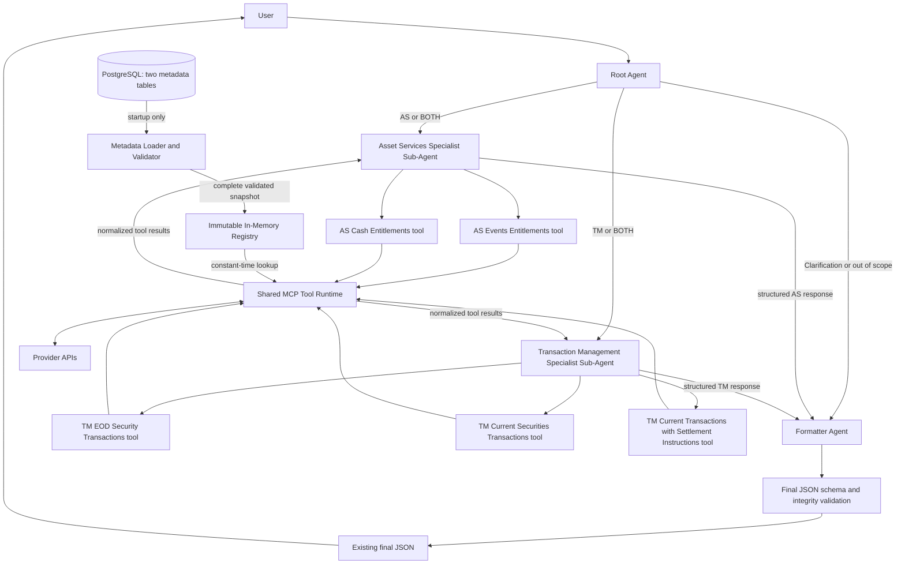

# Octobot Architecture Design

Date: 2026-08-31

Status: reviewed target design

## 1. Purpose and scope

This document explains the current Octobot failures and defines an implementable target architecture for two business domains and five provider services:

```text
User
  -> Root Agent
      -> Asset Services Specialist Sub-Agent
          -> 2 Asset Services tools
      -> Transaction Management Specialist Sub-Agent
          -> 3 Transaction Management tools
  -> structured specialist responses
  -> Formatter Agent
  -> existing final JSON contract
```

The target design makes these decisions explicit:

1. There is one MCP tool for each provider portable ID: two AS tools and three TM tools.
2. The five tools run on one MCP server and share the same implementation code.
3. Agents select tools by business purpose and never receive portable IDs, provider URLs, or provider column names.
4. PostgreSQL contains service and column metadata in only two tables and remains the metadata source of truth.
5. Each MCP replica loads and validates all five service definitions once at startup, then serves requests from an immutable in-memory registry. There are no PostgreSQL calls in the request path.
6. A tool's existing registered `tool_name` is the lookup key for its metadata row. No additional service identifier is introduced.
7. Portable IDs are stored in PostgreSQL and are not hardcoded in tool wrappers.
8. Provider base URLs, authentication, certificates, and runtime settings remain deployment configuration, not service metadata.
9. Specialists return structured factual results. The Formatter Agent owns all final response formatting.
10. The existing final JSON structure remains unchanged.
11. Agent storage and agent-runtime internals are outside this document. The tools repository contains MCP and provider code, not agent definitions.

## 2. Current architecture problems

### 2.1 Evidence boundary

The current-code findings below are based on the source excerpts and production trace previously supplied. File paths and approximate line numbers identify the reported implementation, but they must be rechecked against the current repository revision before editing because code may have moved.

The Excel screenshots are the source for service and dictionary headers and for the three confirmed TM service records. They do not define every business code or every provider behavior. Any field whose semantics are not visible in the supplied material is identified as a confirmation gate rather than presented as fact.

### 2.2 `Unknown service`: logical name and portable ID are mixed

The reported request model in `octobot_mcp/models/apigee.py:17-29` requires `service_portable_id` but makes `service_name` optional:

```python
service_portable_id: str = Field(
    min_length=1,
    max_length=100,
    description="ServicePortableID of the target service, from the discovery call.",
)

service_name: str | None = Field(
    default=None,
    max_length=200,
    description=(
        "Optional service name used for schema validation. "
        "When omitted, the schema is resolved from service_portable_id."
    ),
)
```

The reported failure path is:

```text
apply_filters
  -> _validate_request_schema
  -> get_service_schema(request.service_name or request.service_portable_id)
  -> ValueError: Unknown service
```

The failing value was a UUID, while the schema registry contained logical names such as:

```text
view_events_entitlements
view_cash_entitlements
```

The identifiers have different jobs:

| Identifier | Correct responsibility |
| --- | --- |
| Logical/source name | Schema, columns, aliases, and filter rules in the current implementation |
| Portable ID | Provider service identity used in `/api/services/{portable_id}/filter` |

They must not be substituted for each other.

A second reported mismatch was:

```text
Discovery name: view_api_octobot_events_entitlements
Registry name:  view_events_entitlements
```

That mismatch should be normalized deterministically during the temporary current-flow fix. It disappears from the agent path in the target architecture because agents no longer perform service discovery.

### 2.3 Too much provider workflow is delegated to the model

The current generic tools require the model to:

1. Discover a service.
2. retain both its name and portable ID.
3. request its dictionary.
4. select exact provider columns.
5. construct provider filters.
6. call the generic filter endpoint.

This allows a valid business request to fail because of a stale UUID, a name mismatch, an invalid provider column, a missing required filter, or malformed filter syntax. These are deterministic API concerns and should be handled by tool code.

### 2.4 Provider failures lose useful structure

The observed provider path returned `500 Internal Server Error`, which was flattened into a generic MCP execution failure. The response reaching the agent needs a safe, structured classification containing:

- which registered tool failed
- provider status when available
- safe correlation ID when available
- whether retry is allowed
- whether another requested service succeeded

Provider response bodies, internal URLs, tokens, certificates, and stack traces must remain only in protected logs.

### 2.5 Current-state issue summary

| Current issue | Effect | Target correction |
| --- | --- | --- |
| Logical names and UUIDs are interchangeable | `Unknown service` before the provider call | Tool name resolves metadata; UUID is used only by the provider adapter |
| Discovery and registry names differ | Exact-string failures | Remove discovery from agents; temporarily normalize current-flow aliases |
| Agents reason over provider identifiers | Stale or invented values | Do not expose identifiers in tool inputs or prompts |
| Agents select columns and build raw filters | Fragile and unsafe requests | Metadata-driven allowlists, validation, and query construction in shared code |
| Generic tools expose several API steps | More model calls and more failure points | Five business-specific tools with one shared implementation |
| Errors are flattened | Weak diagnosis and lost partial results | Stable tool error envelope and deterministic status aggregation |
| Multi-service response ownership is unclear | Duplicated or inconsistent tables | Tools normalize; specialists aggregate unchanged; formatter creates final JSON |

### 2.6 Temporary fixes if the target migration cannot be immediate

These are compatibility fixes for the existing discovery/dictionary/filter flow. They are not part of the target tool contract.

#### Require both current identifiers

Make `service_name` required in the current request model and tool signature:

```python
service_name: str = Field(
    min_length=1,
    max_length=200,
    description="Stable logical name used only for local schema validation.",
)
```

Validate discovery output without substituting one value for the other:

```python
def validate_discovered_service(service: dict[str, object]) -> tuple[str, str]:
    service_name = str(service.get("Name") or "").strip()
    portable_id = str(service.get("ServicePortableID") or "").strip()

    if not service_name:
        raise ValueError("Discovery result is missing Name")
    if not portable_id:
        raise ValueError("Discovery result is missing ServicePortableID")

    return service_name, portable_id
```

#### Keep schema lookup and provider routing separate

```python
schema = get_service_schema(request.service_name)
path = f"/api/services/{request.service_portable_id}/filter"
```

Do not retain a normal lookup path such as:

```python
get_service_schema(request.service_name or request.service_portable_id)
```

#### Normalize the known current-flow aliases

```python
_SERVICE_NAME_ALIASES = {
    "view_api_octobot_events_entitlements": "view_events_entitlements",
    "view_api_octobot_cash_entitlements": "view_cash_entitlements",
}
```

This alias registry is temporary compatibility code. Target tools resolve their service directly by registered tool name and do not call discovery.

#### Validate values before provider calls

Use dictionary data types to reject malformed numbers and dates locally. Do not silently strip unknown suffixes:

```python
def validate_numeric_filter(column_name: str, value: str) -> str:
    normalized = value.strip()
    if not normalized.isdigit():
        raise ValueError(
            f"Invalid value for {column_name}: expected digits only"
        )
    return normalized
```

#### Preserve structured errors

For the temporary implementation, retry only transport failures, `429`, `502`, `503`, and `504`. Do not automatically retry a provider `500`; malformed input can also produce `500`, so retrying may repeat the same invalid request.

```python
def classify_upstream_status(status_code: int) -> tuple[str, bool]:
    if status_code in {401, 403}:
        return "AUTHENTICATION_ERROR", False
    if status_code == 429:
        return "RATE_LIMITED", True
    if status_code in {502, 503, 504}:
        return "UPSTREAM_UNAVAILABLE", True
    if status_code >= 500:
        return "UPSTREAM_ERROR", False
    return "UPSTREAM_REJECTED_REQUEST", False
```

Deploy the temporary model, tool signature, schema lookup, alias normalization, caller prompt, and tests in one release. Do not deploy only the required-field change because existing callers would then fail validation.

### 2.7 Temporary-fix regression tests

At minimum, verify:

```text
missing service_name                  -> local validation failure
portable ID used as schema key        -> local validation failure
known discovery alias                 -> canonical schema
invalid numeric filter                -> no provider call
provider 500                          -> ERROR, retryable false
provider 503                          -> ERROR, retryable true
provider response body/internal URL   -> absent from agent result
```

If the five target tools can be delivered immediately, implement the target architecture instead of extending the temporary discovery workflow.

## 3. Target architecture

### 3.1 Component responsibilities

| Component | Owns | Does not own |
| --- | --- | --- |
| Root Agent | Domain routing and explicit business-entity extraction | Service selection, portable IDs, columns, provider calls |
| AS Specialist Sub-Agent | AS intent, AS tool selection, missing AS inputs, aggregation of AS tool results | TM tools, provider mechanics, final formatting |
| TM Specialist Sub-Agent | TM intent, TM tool selection, missing TM inputs, aggregation of TM tool results | AS tools, provider mechanics, final formatting |
| Five MCP tools | Stable business-facing contracts, one per service | Cross-domain routing or final response composition |
| Startup Metadata Loader | Read both metadata tables, assemble one complete snapshot, validate all five bindings, publish readiness | Serving live tool requests or partial metadata |
| Immutable In-Memory Registry | Constant-time lookup by registered `tool_name` during tool execution | Database writes, periodic refresh, provider calls |
| Shared MCP Tool Runtime | Registry lookup, alias resolution, validation, query building, provider calls, retry, normalization | Business intent classification or user-facing prose |
| PostgreSQL Metadata | Source of truth for five service mappings and their complete column dictionaries | Request-path lookup, secrets, base URLs, agent prompts, agent behavior |
| Formatter Agent | Final table/attribute/status construction in the existing JSON schema | Data retrieval, tool calls, provider inference |
| Final JSON validator | Enforce the final schema and verify table/row/value integrity before return | Business interpretation or formatting decisions |

The Shared MCP Tool Runtime is ordinary code inside the tools repository. It is not the platform's agent executor and does not store or run agent definitions.

### 3.2 Non-negotiable boundaries

```text
Agents decide:
  business domain
  business intent
  explicitly supplied business entities
  which visible business tool or tools are required
  whether clarification is required

Shared tool code decides:
  service metadata row
  portable ID
  provider columns
  field aliases
  required filters
  data-type conversion
  provider query syntax
  authentication
  timeout and retry behavior
  normalized tool result

Formatter Agent decides:
  final table IDs
  final table and attribute layout
  final overall status
  clarification options
  representation in the existing final JSON schema
```

Agents never receive or produce portable IDs, provider URLs, tokens, raw filter expressions, or stack traces.

PostgreSQL is part of the metadata control plane, not the request execution path:

```text
MCP startup:
  PostgreSQL -> load both tables -> build and validate complete snapshot
             -> publish immutable in-memory registry -> readiness succeeds

Every tool request:
  wrapper -> in-memory registry lookup -> shared executor -> provider API

PostgreSQL calls per tool request: 0
```

### 3.3 Identifier model

Only these identifiers are required:

| Identifier | Location | Purpose | May change without code deployment? |
| --- | --- | --- | --- |
| `tool_name` | MCP registration and `octobot_service` | Stable public tool contract and metadata lookup key | No; renaming is a contract change |
| `portable_id` | `octobot_service` only | Provider service UUID | Yes; publish metadata and roll the MCP replicas |
| `service_id` | PostgreSQL only | Parent key for dictionary rows | Yes; never leaves metadata layer |
| `source_name` | PostgreSQL only | Technical name imported from the workbook | Yes, subject to source governance |

Reusing the registered `tool_name` avoids another identifier while still allowing each wrapper to locate its metadata.

The tool name is necessarily present in code because MCP requires a stable registered name. The portable ID is provider-owned data and therefore remains only in PostgreSQL.

### 3.4 Confirmed five-tool model

| Domain | Registered MCP tool | Provider service purpose | Metadata status |
| --- | --- | --- | --- |
| AS | `query_as_events_entitlements` | Corporate-action event facts, event status, and event dates | Import full AS workbook and confirm portable ID |
| AS | `query_as_cash_entitlements` | Cash entitlement and payment facts | Import full AS workbook and confirm portable ID |
| TM | `query_tm_eod_security_transactions` | EOD security transaction data for an account and date | Confirmed from supplied TM screenshot |
| TM | `query_tm_current_securities_transactions` | Current/recent security transaction activity | Confirmed from supplied TM screenshot |
| TM | `query_tm_current_securities_transactions_with_settlement_instruction_details` | Current transaction activity requiring settlement-instruction detail | Confirmed from supplied TM screenshot |

Confirmed TM metadata visible in the supplied screenshots:

| Tool | Catalog | Source name | English name | Portable ID |
| --- | --- | --- | --- | --- |
| `query_tm_eod_security_transactions` | `CDS2_ALL` | `VIEW_CDS2_Transactions` | EOD Security Transactions Dataset | `f35ab57f-9213-453f-92bd-7c0136844f58` |
| `query_tm_current_securities_transactions` | `CDS2_RT` | `TCD2_JOINS_IOD` | Current Securities Transactions | `fdbc0b64-8bb3-46e2-b4fa-dccccd4cc377` |
| `query_tm_current_securities_transactions_with_settlement_instruction_details` | `CDS2_RT` | `TCD2_JOINS_IOD_SFE` | Current Securities Transactions with settlement instruction details | `c9872ea4-dd87-4721-baa0-00aff7387aaf` |

Do not infer the two AS portable IDs from unrelated traces. Import and verify them from their authoritative service workbooks before enabling the AS tools.

## 4. Architecture diagram

High-resolution architecture diagram: [PNG](./Octobot_High_Level_Architecture.png) | [Editable SVG](./Octobot_High_Level_Architecture.svg)




The database arrow ends at startup initialization. It does not enter the live request path. The important return path is `tool runtime -> specialist -> formatter`. The formatter never receives raw provider data directly and never calls a tool.

## 5. End-to-end runtime flow

### 5.1 Step 1: receive the request

The root receives an immutable request envelope:

```json
{
  "requestId": "req_123",
  "userQuery": "Show failed current transactions for safe account 4205640693."
}
```

`requestId` must be propagated through every agent handoff, tool call, provider log, and final response log. It is operational context, not provider data.

### 5.2 Step 2: route the business domain

The root returns exactly one route:

```text
ASSET_SERVICES
TRANSACTION_MANAGEMENT
BOTH
NEEDS_CLARIFICATION
OUT_OF_SCOPE
```

Root output contract:

```json
{
  "requestId": "req_123",
  "route": "TRANSACTION_MANAGEMENT",
  "reason": "The request asks for current failed transaction activity.",
  "entities": {
    "safeAccount": "4205640693"
  },
  "missingInputs": []
}
```

The original `userQuery` is passed unchanged to the selected specialist in addition to the root's extracted entities. This prevents the root summary from discarding business meaning.

The root must not select services. It can request clarification only when the domain itself is ambiguous. Domain-specific missing fields are checked by the specialist and then by deterministic tool validation.

Validate the root result against its structured schema. If it is invalid after one constrained retry, stop the request with the existing controlled internal-error response; do not guess a route.

Root prompt:

```text
You are the Octobot root routing agent.

Classify the user request as ASSET_SERVICES, TRANSACTION_MANAGEMENT, BOTH,
NEEDS_CLARIFICATION, or OUT_OF_SCOPE.

Extract only business entities explicitly present in the request. Preserve the
original user query for the selected specialist. Do not select services, tools,
portable IDs, provider columns, endpoints, or providers. Do not answer the
business question. Return only the required structured routing result.
```

### 5.3 Step 3: invoke the selected specialist or specialists

For `ASSET_SERVICES`, only the AS specialist runs. For `TRANSACTION_MANAGEMENT`, only the TM specialist runs. For `BOTH`, the existing agent runtime starts both specialists concurrently because neither domain depends on the other.

Specialist input:

```json
{
  "requestId": "req_123",
  "userQuery": "Show failed current transactions for safe account 4205640693.",
  "route": "TRANSACTION_MANAGEMENT",
  "entities": {
    "safeAccount": "4205640693"
  }
}
```

No portable ID, source name, endpoint, or provider column is included.

### 5.4 Step 4: select the smallest sufficient tool set

The specialist uses the visible MCP tool names and descriptions:

| Need | Tool selection |
| --- | --- |
| Corporate-action event facts only | `query_as_events_entitlements` |
| Cash entitlement/payment facts only | `query_as_cash_entitlements` |
| Event plus its cash entitlement | Both AS tools |
| Historical/as-of EOD transactions | `query_tm_eod_security_transactions` |
| Current/recent transaction activity | `query_tm_current_securities_transactions` |
| Settlement-instruction fields | `query_tm_current_securities_transactions_with_settlement_instruction_details` |
| Current transaction facts plus settlement instructions | Current TM tool plus settlement-instruction TM tool only when both result sets are required |

The specialist must not call every visible tool by default. It calls the smallest set that can answer the request.

If calls depend only on user-provided entities, they may execute in parallel. If a later call needs a business key returned by an earlier call, they execute sequentially. Only documented business keys may be passed between calls.

No implicit cross-service join is allowed. Each tool returns its own table. A combined table may be created only when an explicit deterministic join rule exists for a confirmed shared business key. Until such a rule is implemented, the formatter presents separate tables.

### 5.5 Step 5: call service-specific MCP tools

Each wrapper has a stable name and passes that name to shared code:

```python
TOOL_NAME = "query_tm_current_securities_transactions"


@mcp.tool(name=TOOL_NAME)
async def query_tm_current_securities_transactions(
    request: ServiceQueryRequest,
) -> ServiceQueryResult:
    return await execute_service_query(
        tool_name=TOOL_NAME,
        expected_domain="TRANSACTION_MANAGEMENT",
        request=request,
    )
```

The UUID is not in the wrapper. `expected_domain` is a defensive assertion: a database mistake cannot silently bind a TM tool to an AS row.

### 5.6 Step 6: execute through shared deterministic code

For every tool call, the Shared MCP Tool Runtime performs this exact sequence:

1. Validate the request envelope and pagination bounds.
2. Resolve the service definition by `tool_name` from the immutable in-memory registry.
3. Verify that the row's `business_domain` equals the wrapper's `expected_domain`.
4. Use the complete column dictionary already attached to that in-memory service definition.
5. Resolve every entity, filter field, and requested field to exactly one allowed dictionary column.
6. Reject unknown or ambiguous aliases before any provider call.
7. Validate required-filter rules and operator compatibility.
8. Convert values according to dictionary data types.
9. Choose output columns from `requestedFields`; otherwise use default output columns.
10. Build a provider request from structured values. Never concatenate an agent-supplied raw filter string.
11. Insert the PostgreSQL-resolved portable ID into the provider adapter's route template.
12. Apply authentication, timeout, and bounded retry policy.
13. Normalize the provider response into the common tool result contract.
14. Emit safe operational logs and metrics using `requestId` and `toolName`.

### 5.7 Step 7: aggregate inside the specialist

The specialist does not reformat or duplicate tool tables. It returns every normalized tool result unchanged under `serviceResults`, adds a short normalized `intent`, and reports missing inputs if no valid tool call can be made. Validate this envelope. If the specialist itself fails after one constrained retry, create a safe specialist-level `ERROR` response with `SPECIALIST_EXECUTION_ERROR` so the formatter can still preserve another domain's successful result.

### 5.8 Step 8: format once

The Formatter Agent receives:

- original user query
- root routing result
- zero, one, or two specialist responses

It derives `toolsUsed` from the service results, creates final table IDs, maps domain outcomes to the final status, and produces the unchanged final JSON structure. A JSON Schema validator rejects malformed formatter output before return.

## 6. Specialist Sub-Agents

### 6.1 Tool visibility

| Agent | Visible tools |
| --- | --- |
| Root Agent | None |
| AS Specialist Sub-Agent | `query_as_events_entitlements`, `query_as_cash_entitlements` |
| TM Specialist Sub-Agent | `query_tm_eod_security_transactions`, `query_tm_current_securities_transactions`, `query_tm_current_securities_transactions_with_settlement_instruction_details` |
| Formatter Agent | None |

Tool allowlists must be enforced by runtime configuration, not only by prompt text.

### 6.2 AS specialist prompt

```text
You are the Octobot Asset Services specialist.

Handle corporate-action event and cash-entitlement requests. You have access
only to the two Asset Services tools.

Select the smallest set of tools that fully answers the user query. Call both
only when both event facts and cash-entitlement facts are required. Parallelize
independent calls. Do not invent a join between service results.

Pass only business entities, structured filters, requested business fields,
time constraints, and pagination. Never pass or invent service names, portable
IDs, provider columns, endpoints, or raw provider filter expressions.

Use only tool results. If required business input is missing, return the
structured clarification fields. Return the required specialist response and
do not create the final user-facing JSON.
```

### 6.3 TM specialist prompt

```text
You are the Octobot Transaction Management specialist.

Handle transaction history, current activity, status, settlement, failure,
pending activity, and settlement-instruction requests. You have access only
to the three Transaction Management tools.

Use the EOD tool for historical/as-of EOD data, the current-transactions tool
for current or recent activity, and the settlement-instruction tool only when
settlement-instruction fields are required. Select the smallest sufficient set.
Parallelize independent calls and sequence only calls that require a documented
business key from an earlier result. Do not invent a cross-service join.

Pass only business entities, structured filters, requested business fields,
time constraints, and pagination. Never pass or invent service names, portable
IDs, provider columns, endpoints, or raw provider filter expressions.

Use only tool results. If required business input is missing, return the
structured clarification fields. Return the required specialist response and
do not create the final user-facing JSON.
```

## 7. MCP tool contract and shared runtime

### 7.1 Common request envelope

All five tools use the same outer contract. Tool descriptions document the business fields supported by that specific service.

```json
{
  "requestId": "req_123",
  "entities": {
    "safeAccount": "4205640693"
  },
  "filters": [
    {
      "field": "transactionStatus",
      "operator": "IN",
      "value": ["FAILED"]
    }
  ],
  "requestedFields": [
    "transactionId",
    "transactionStatus",
    "amount",
    "settlementDate"
  ],
  "pagination": {
    "offset": 0,
    "limit": 500
  }
}
```

Rules:

- `requestId` is required.
- `entities` uses canonical business terms documented by the tool.
- Each entity becomes an equality condition. If the same field also appears in `filters`, equal values are deduplicated and conflicting values return `INVALID_REQUEST`.
- `filters` is structured; raw OData/provider expressions are prohibited.
- Dates and time windows are expressed against an explicit documented business field in `filters`; there is no ambiguous generic time-range field.
- Supported operators are allowlisted by code and data type.
- `requestedFields` contains business terms, not provider columns.
- Empty `requestedFields` means use dictionary fields marked `is_default_output`.
- `pagination.limit` is capped by deployment configuration and provider limits.
- The agent cannot pass `toolName`, `portableId`, endpoint, catalog, or source name.

### 7.2 Field resolution

Each dictionary row has one architecture-added `business_name`, such as `safeAccount` or `transactionStatus`. This is the stable LLM-facing key used in tool requests and normalized tool results. The provider's `original_column_name` remains internal.

For one service, the resolver builds its accepted input map from:

1. `business_name`
2. every approved value in `aliases`

Normalization is deterministic: trim whitespace, lowercase, and remove only approved presentation separators such as spaces and underscores. Do not perform fuzzy matching.

Exactly one dictionary column must match. Zero matches produce `INVALID_FIELD`; more than one match produces `AMBIGUOUS_FIELD` and blocks the provider call.

`english_column_name` is used as the display label, and `original_column_name` is used only when constructing the provider request. Neither is accepted as an agent input unless it is deliberately added to `aliases`. Service-level aliases are unnecessary because target tools resolve services by registered `tool_name`.

### 7.3 Filter and output validation

The runtime loads all dictionary rows for the service, not only default outputs and required filters. Optional filter fields would otherwise be omitted incorrectly.

Validation rules:

```text
requested output field
  -> must match a dictionary row with is_output_column = true

filter field
  -> must match a dictionary row
  -> operator must be valid for its data_type
  -> value must parse as that data_type

no requestedFields
  -> use is_default_output = true in column_order
  -> if none exist, use is_output_column = true in column_order
  -> if neither exists, return METADATA_INVALID
```

Initial conservative operator allowlist:

| Data type family | Allowed operators |
| --- | --- |
| string, code, UUID | `EQ`, `NE`, `IN` |
| integer, decimal | `EQ`, `NE`, `IN`, `LT`, `LTE`, `GT`, `GTE`, `BETWEEN` |
| date, timestamp | `EQ`, `LT`, `LTE`, `GT`, `GTE`, `BETWEEN` |
| boolean | `EQ` |

Add operators such as `CONTAINS` only after the provider contract confirms their syntax and behavior.

Proposed required-filter group semantics:

- A required field with no `filter_group_number` is individually required.
- For each positive `filter_group_number`, at least one field in that group is required.
- Fields not marked `is_required_filter` remain optional.

This group interpretation must be confirmed with the workbook/service owner before production enablement. The import validator should reject inconsistent groups rather than guess.

### 7.4 Provider construction

The provider route is common code:

```python
path = f"/api/services/{service.portable_id}/filter"
```

It is not a database column because all five services use the same confirmed route. The provider base URL, authentication URL/scope, credentials, certificates, connection pool, and timeout settings come from deployment configuration and secret management.

The query builder must:

- use only resolved allowlisted provider columns
- encode values through a structured serializer
- use UTC ISO-8601 timestamps
- enforce provider page-size limits
- reject unsupported operators locally
- never execute `filter_query`, `expression`, or any agent-supplied string as SQL
- treat workbook `expression` as provider metadata only after its semantics and safety are confirmed

### 7.5 Retry and timeout policy

Default policy for the idempotent provider read:

| Failure | Retry? | Default behavior |
| --- | --- | --- |
| Invalid request or metadata | No | Return local error; provider is not called |
| `401` or `403` | No | Return authentication error and alert |
| `404` | No | Return provider configuration error |
| `429` | Yes | Respect `Retry-After`; bounded retry |
| `500` | No by default | Return upstream error; enable retry only with provider confirmation |
| `502`, `503`, `504` | Yes | Maximum two retries with exponential backoff and jitter |
| Connect/read timeout | Yes | Maximum two retries within the total request deadline |
| Other `4xx` | No | Return provider rejected-request error |

The entire call must have a total deadline. Retries must stop when the remaining deadline cannot support another attempt.

### 7.6 Common tool result contract

Every tool returns exactly this shape:

```json
{
  "requestId": "req_123",
  "toolName": "query_tm_current_securities_transactions",
  "domain": "TRANSACTION_MANAGEMENT",
  "status": "SUCCESS",
  "tables": [
    {
      "name": "Current Securities Transactions",
      "columns": [
        {
          "key": "transactionId",
          "label": "Transaction ID",
          "dataType": "string"
        },
        {
          "key": "transactionStatus",
          "label": "Status",
          "dataType": "string"
        }
      ],
      "rows": [
        {
          "transactionId": "TX-1001",
          "transactionStatus": "FAILED"
        }
      ]
    }
  ],
  "attributes": {
    "recordCount": 1
  },
  "pagination": {
    "offset": 0,
    "limit": 500,
    "hasMore": false
  },
  "warnings": [],
  "error": null
}
```

The table `name` comes from service `english_name`. Each column `key` is the dictionary `business_name`; `label` is `english_column_name` when present and otherwise `business_name`. Provider response fields are rewritten from `original_column_name` to `business_name` before the result reaches the specialist.

Allowed tool statuses are only:

```text
SUCCESS
NO_DATA
ERROR
```

Errors are classified in `error.code`, not represented as additional status values:

```json
{
  "requestId": "req_123",
  "toolName": "query_tm_current_securities_transactions",
  "domain": "TRANSACTION_MANAGEMENT",
  "status": "ERROR",
  "tables": [],
  "attributes": {},
  "pagination": null,
  "warnings": [],
  "error": {
    "code": "UPSTREAM_ERROR",
    "message": "The transaction service could not complete the request.",
    "retryable": false,
    "providerStatus": 500,
    "correlationId": "corr_123",
    "details": null
  }
}
```

Supported error codes:

```text
INVALID_REQUEST
INVALID_FIELD
AMBIGUOUS_FIELD
MISSING_REQUIRED_FILTER
METADATA_NOT_FOUND
METADATA_INVALID
PROVIDER_CONFIGURATION_ERROR
AUTHENTICATION_ERROR
RATE_LIMITED
TIMEOUT
UPSTREAM_REJECTED_REQUEST
UPSTREAM_ERROR
UPSTREAM_UNAVAILABLE
```

Use `NO_DATA` only when the provider call completed successfully and returned zero records. Use `ERROR` for validation, metadata, authentication, timeout, or provider failures. For `MISSING_REQUIRED_FILTER`, `details` has the safe shape `{"missingFields": ["safeAccount"]}`; it must not contain provider column names.

To keep the formatter input bounded, the shared runtime enforces configured limits for rows, selected fields, and serialized result bytes. When more provider data exists, return the permitted page, set `pagination.hasMore` to `true`, and add a safe `RESULT_LIMIT_APPLIED` warning. Never silently truncate rows inside the Formatter Agent.

Portable IDs, provider URLs, credentials, raw response bodies, and stack traces are never returned.

## 8. PostgreSQL metadata design

### 8.1 Why two tables are sufficient

```text
octobot_service
  one row per registered MCP tool/service
       |
       +--< octobot_service_column
              one row per DICTIONARIES-sheet column
```

There is no environment/deployment table because the supplied architecture constraint states that portable IDs work in every environment. There are no separate domain, account-type, alias, flag, endpoint, or provider-setting tables.

### 8.2 Table 1: `octobot_service`

```sql
CREATE TABLE octobot_service (
    service_id BIGINT GENERATED ALWAYS AS IDENTITY PRIMARY KEY,

    -- Existing public MCP name; target metadata lookup key.
    tool_name TEXT NOT NULL UNIQUE,
    business_domain TEXT NOT NULL CHECK (
        business_domain IN ('ASSET_SERVICES', 'TRANSACTION_MANAGEMENT')
    ),

    -- Imported from the SERVICE sheet.
    catalog TEXT NOT NULL,
    portable_id UUID NOT NULL UNIQUE,
    source_name TEXT NOT NULL,
    english_name TEXT NOT NULL,
    description TEXT,
    service_type TEXT,
    data_entitlement_model_type TEXT,
    filter_query TEXT,
    account_types TEXT,
    source_domain TEXT,
    source_subdomain TEXT,
    dataset TEXT,

    extra_metadata JSONB NOT NULL DEFAULT '{}'::jsonb,
    created_at TIMESTAMPTZ NOT NULL DEFAULT now(),
    updated_at TIMESTAMPTZ NOT NULL DEFAULT now(),

    UNIQUE (catalog, source_name)
);
```

`updated_at` must be maintained by the metadata import/upsert code. A trigger is optional; do not assume the default updates on row modification.

### 8.3 Table 2: `octobot_service_column`

```sql
CREATE TABLE octobot_service_column (
    service_column_id BIGINT GENERATED ALWAYS AS IDENTITY PRIMARY KEY,
    service_id BIGINT NOT NULL REFERENCES octobot_service(service_id)
        ON DELETE CASCADE,

    original_column_name TEXT NOT NULL,
    business_name TEXT NOT NULL,
    english_column_name TEXT,
    column_description TEXT,
    data_type TEXT NOT NULL,
    column_order INTEGER NOT NULL CHECK (column_order > 0),

    is_trusted BOOLEAN NOT NULL DEFAULT FALSE,
    is_default_output BOOLEAN NOT NULL DEFAULT FALSE,
    is_critical_data_element BOOLEAN NOT NULL DEFAULT FALSE,
    critical_data_element_category TEXT,
    is_grain BOOLEAN NOT NULL DEFAULT FALSE,
    grain_type TEXT,
    is_key BOOLEAN NOT NULL DEFAULT FALSE,
    sort_order INTEGER,
    is_output_column BOOLEAN NOT NULL DEFAULT FALSE,
    is_calculated_column BOOLEAN NOT NULL DEFAULT FALSE,
    is_client_code_column BOOLEAN NOT NULL DEFAULT FALSE,
    is_parameter BOOLEAN NOT NULL DEFAULT FALSE,
    is_range BOOLEAN NOT NULL DEFAULT FALSE,
    is_required_filter BOOLEAN NOT NULL DEFAULT FALSE,
    filter_group_number INTEGER,
    partition_key_index INTEGER,
    is_partitioning_field BOOLEAN NOT NULL DEFAULT FALSE,
    expression TEXT,

    -- Architecture-added business terms, e.g. safeAccount.
    aliases TEXT[] NOT NULL DEFAULT '{}',
    extra_metadata JSONB NOT NULL DEFAULT '{}'::jsonb,
    created_at TIMESTAMPTZ NOT NULL DEFAULT now(),
    updated_at TIMESTAMPTZ NOT NULL DEFAULT now(),

    UNIQUE (service_id, original_column_name),
    UNIQUE (service_id, business_name),
    UNIQUE (service_id, column_order)
);
```

No additional indexes are required initially. The primary keys and unique constraints already index `tool_name`, `portable_id`, and `(service_id, column_order)`, and all aliases are resolved from the small in-memory registry.

### 8.4 Source and meaning of service fields

| PostgreSQL column | Source | Meaning |
| --- | --- | --- |
| `service_id` | Architecture-added | PostgreSQL parent key; never exposed outside metadata code |
| `tool_name` | MCP architecture-added | Existing registered MCP tool name and metadata lookup key |
| `business_domain` | Architecture-added | `ASSET_SERVICES` or `TRANSACTION_MANAGEMENT`; not the workbook Domain field |
| `catalog` | Excel `Catalog` | Source catalog identifier |
| `portable_id` | Excel `Portable Id` | Provider service UUID used only by provider code |
| `source_name` | Excel `Name` | Technical provider service/dataset name |
| `english_name` | Excel `English Name` | Human-readable service name |
| `description` | Excel `Description` | Source-provided service description |
| `service_type` | Excel `Type` | Source service/data type; allowed values require confirmation |
| `data_entitlement_model_type` | Excel `Data Entitlement Model Type` | Source entitlement-model code; code meanings require confirmation |
| `filter_query` | Excel `Filter Query` | Preserved source value; not executable until semantics and safety are confirmed |
| `account_types` | Excel `Account Types` | Raw source applicability value, e.g. `S/K`; delimiter and code meanings require confirmation |
| `source_domain` | Excel `Domain` | Source catalog classification, which may be `Unspecified` |
| `source_subdomain` | Excel `Subdomain` | Source catalog sub-classification |
| `dataset` | Excel `Dataset` | Source dataset classification/name |
| `extra_metadata` | Architecture-added | Holds uncommon future source fields without another table |
| timestamps | Architecture-added | Metadata audit timestamps |

#### 8.4.1 Source and meaning of dictionary fields

| PostgreSQL column | Source | Meaning |
| --- | --- | --- |
| `service_column_id` | Architecture-added | PostgreSQL row key |
| `service_id` | Derived during import | Parent resolved from Excel `Catalog`, `Service`, and `Portable Id` |
| `original_column_name` | Excel `Original Column Name` | Exact provider field used by the query builder |
| `business_name` | Architecture-added | Stable camelCase field exposed in tool requests/results |
| `english_column_name` | Excel `English Column Name` | Human-readable display label and source for the initial business-name candidate |
| `column_description` | Excel `Column Description` | Source explanation of the field |
| `data_type` | Excel `Data Type` | Source type used for local value conversion and operator validation |
| `column_order` | Excel `Column Order` | Stable source order used for defaults and output ordering |
| `is_trusted` | Excel `Is Trusted` | Source trust flag; authorization/use semantics require owner confirmation |
| `is_default_output` | Excel `Is Default Output` | Include when no explicit output fields are requested |
| `is_critical_data_element` | Excel `Is Critical Data Element` | Source CDE flag |
| `critical_data_element_category` | Excel `Critical Data Element Category` | Source CDE category |
| `is_grain` | Excel `Is Grain` | Source indicator that the field participates in dataset grain |
| `grain_type` | Excel `Grain Type` | Source grain classification |
| `is_key` | Excel `Is Key` | Source key indicator; a possible join key only after business confirmation |
| `sort_order` | Excel `Sort Order` | Source default sort order; zero is preserved when it is an actual source value |
| `is_output_column` | Excel `Is Output Column` | Field may be selected in a provider response |
| `is_calculated_column` | Excel `Is Calculated Column` | Source calculated-field flag |
| `is_client_code_column` | Excel `Is Client Code Column` | Source client-code flag; exact use requires owner confirmation |
| `is_parameter` | Excel `Is Parameter` | Source parameter flag used by the provider contract |
| `is_range` | Excel `Is Range` | Source indication that range semantics may be supported |
| `is_required_filter` | Excel `Is Required Filter` | Field participates in local required-input validation |
| `filter_group_number` | Excel `Filter Group Number` | Proposed alternative-group identifier; semantics require confirmation |
| `partition_key_index` | Excel `Partition Key Index` | Source partition-key position |
| `is_partitioning_field` | Excel `Is Partitioning Field` | Source partitioning flag |
| `expression` | Excel `Expression` | Preserved source expression; never executed until semantics and safety are approved |
| `aliases` | Architecture-added | Approved alternative business terms for `business_name` |
| `extra_metadata` | Architecture-added | Future uncommon source fields |
| timestamps | Architecture-added | Metadata audit timestamps |

The source flag names above are visible in the supplied screenshots, but their enterprise business semantics are not fully defined there. The implementation can preserve them immediately; behavior that depends on an uncertain flag must remain behind the confirmation gates in Phase 0.

`Catalog`, `Service`, and `Portable Id` are used during import to resolve the parent `service_id`; they are not duplicated on every column row.

Blank booleans are normalized to `FALSE`. Blank text and numeric cells become `NULL`, not empty strings or zero. `Account Types` is preserved exactly as source text until its delimiter and code meanings are confirmed.

`business_name` and `aliases` are architecture-added column metadata. The importer generates a camelCase candidate from `English Column Name`, applies any approved overrides from a small version-controlled alias manifest, and rejects collisions. When the English name is blank or does not produce a valid unique business name, an explicit manifest override is mandatory; the importer must not expose the provider column automatically. That manifest belongs in the tools repository and is published together with the workbooks.

### 8.5 Startup metadata load and request-time lookup

The metadata loader runs these queries once while an MCP replica starts. It first loads each service by its registered name:

```sql
SELECT
    service_id,
    tool_name,
    business_domain,
    portable_id,
    source_name,
    english_name
FROM octobot_service
WHERE tool_name = $1;
```

It then loads all dictionary rows for each service:

```sql
SELECT
    service_column_id,
    original_column_name,
    business_name,
    english_column_name,
    column_description,
    data_type,
    column_order,
    is_trusted,
    is_default_output,
    is_critical_data_element,
    critical_data_element_category,
    is_grain,
    grain_type,
    is_key,
    sort_order,
    is_output_column,
    is_calculated_column,
    is_client_code_column,
    is_parameter,
    is_range,
    is_required_filter,
    filter_group_number,
    partition_key_index,
    is_partitioning_field,
    expression,
    aliases,
    extra_metadata
FROM octobot_service_column
WHERE service_id = $1
ORDER BY column_order;
```

Loading all rows is intentional. Loading only required/default rows would make optional filters and explicitly requested outputs impossible to validate.

After validating all five definitions, the loader publishes one immutable registry keyed by `tool_name`. A live tool call performs only an in-process lookup:

```python
service_definition = metadata_registry.require(tool_name)
```

The value already contains the service row, portable ID, approved aliases, and complete dictionary. The repository is not called during tool execution. This gives constant-time metadata access while keeping PostgreSQL as the authoritative source.

### 8.6 Metadata import and publication

Use a repeatable import command in the tools repository:

```text
read five workbooks
  -> validate required SERVICE and DICTIONARIES headers
  -> normalize blank values and booleans
  -> validate UUIDs and parent references
  -> assign the five approved tool names and business domains
  -> generate business names and merge the approved alias manifest
  -> detect duplicate columns, orders, and aliases
  -> write all five services and dictionaries in one database transaction
  -> run metadata validation report
  -> publish an approved metadata version
  -> roll the MCP replicas so each loads that version at startup
```

Do not partially publish one service's row without its dictionary. If any service fails validation, roll back the transaction.

Within that transaction, upsert each service row by `tool_name`, update `updated_at`, and replace that service's complete child dictionary set. Replacing the full child set prevents columns removed from a workbook from remaining as stale metadata. Preserve service IDs by upserting the parent before deleting and reinserting its children.

### 8.7 Immutable registry lifecycle

The MCP server loads all five service definitions at startup because the dataset is small. A replica is not ready until the complete snapshot has passed every validation rule.

Readiness must fail when:

- a registered tool has no service row
- two tool names or portable IDs collide
- a service has no dictionary rows
- aliases are ambiguous within a service
- a service has no selectable output columns
- the wrapper's expected domain differs from metadata

The registry remains unchanged for the lifetime of the process. The base design has no TTL, background database polling, or partial live refresh. This prevents different requests on one replica from observing different metadata versions and removes database availability from normal request handling.

To change a portable ID or dictionary, publish all five definitions transactionally, validate the publication, and perform a rolling MCP restart. New replicas load the new complete version before becoming ready; existing replicas drain while continuing to use their previous complete version. A failed startup load keeps that new replica out of service and does not affect healthy replicas.

The implementation shape is deliberately small:

```python
async def initialize_metadata_registry(repository: ServiceRepository) -> MetadataRegistry:
    services = await repository.load_all_services_with_columns()
    snapshot = MetadataRegistry.build(services)
    snapshot.validate_expected_tools(EXPECTED_TOOL_BINDINGS)
    log_metadata_fingerprint(snapshot.fingerprint)
    return snapshot.freeze()


async def execute_service_query(tool_name: str, expected_domain: str, request):
    service = metadata_registry.require(tool_name)
    service.assert_domain(expected_domain)
    return await shared_service_executor.execute(service, request)
```

`metadata_registry` is created before the server reports ready and is never reassigned during that process lifetime. Repository methods are therefore absent from `execute_service_query` and all lower request-path functions.

This is intentionally simpler than live refresh. If operational evidence later proves that restart-based publication is too slow, a future design may add a complete-snapshot atomic swap. It must never refresh individual service rows or dictionaries independently.

Changing a portable ID therefore requires no wrapper or agent change, only a metadata publication and rolling MCP restart.

### 8.8 Example service row

```sql
INSERT INTO octobot_service (
    tool_name,
    business_domain,
    catalog,
    portable_id,
    source_name,
    english_name,
    description,
    service_type,
    data_entitlement_model_type,
    account_types,
    source_domain,
    source_subdomain,
    dataset
) VALUES (
    'query_tm_current_securities_transactions',
    'TRANSACTION_MANAGEMENT',
    'CDS2_RT',
    'fdbc0b64-8bb3-46e2-b4fa-dccccd4cc377'::uuid,
    'TCD2_JOINS_IOD',
    'Current Securities Transactions',
    'Provides recent securities transaction activity for each safekeeping account.',
    'database',
    'CDS',
    'S/K',
    'Unspecified',
    'Unspecified',
    'Unspecified'
);
```

The UUID appears here because this is metadata imported from the source workbook. It does not appear in the MCP wrapper or agent input.

## 9. Specialist response and Formatter Agent

### 9.1 Specialist response contract

Both specialists return the same envelope. Tool tables exist only inside `serviceResults`; they are not duplicated at specialist top level.

```json
{
  "requestId": "req_123",
  "domain": "TRANSACTION_MANAGEMENT",
  "status": "NO_DATA",
  "intent": "get_failed_current_transactions",
  "serviceResults": [
    {
      "requestId": "req_123",
      "toolName": "query_tm_current_securities_transactions",
      "domain": "TRANSACTION_MANAGEMENT",
      "status": "NO_DATA",
      "tables": [],
      "attributes": {
        "recordCount": 0
      },
      "pagination": null,
      "warnings": [],
      "error": null
    }
  ],
  "missingInputs": [],
  "warnings": [],
  "error": null
}
```

Allowed specialist statuses:

```text
SUCCESS
NO_DATA
PARTIAL
NEEDS_CLARIFICATION
ERROR
```

Status derivation:

| Condition | Specialist status |
| --- | --- |
| A requested part cannot run because required business input is missing | `NEEDS_CLARIFICATION` |
| Every called tool returns `SUCCESS` or `NO_DATA`, and at least one returns `SUCCESS` | `SUCCESS` |
| Every called tool returns `NO_DATA` | `NO_DATA` |
| At least one tool returns `SUCCESS` or `NO_DATA`, and at least one returns `ERROR` | `PARTIAL` |
| Every required tool returns `ERROR` | `ERROR` |

If a tool returns `MISSING_REQUIRED_FILTER`, the specialist copies `error.details.missingFields` into `missingInputs` and returns `NEEDS_CLARIFICATION`. Any already completed service results may remain in `serviceResults`, but the formatter must prioritize the clarification status. This derivation should be validated by runtime code after the specialist responds. The specialist cannot mark an all-error result as success.

The top-level `error` remains `null` for normal tool outcomes because their errors stay in `serviceResults`. It is reserved for a specialist failure with this safe shape:

```json
{
  "code": "SPECIALIST_EXECUTION_ERROR",
  "message": "The Transaction Management specialist could not complete the request."
}
```

### 9.2 Clarification response

Use camelCase consistently:

```json
{
  "requestId": "req_123",
  "domain": "ASSET_SERVICES",
  "status": "NEEDS_CLARIFICATION",
  "intent": "get_cash_entitlements",
  "serviceResults": [],
  "missingInputs": [
    {
      "field": "safeAccount",
      "message": "A safe account is required.",
      "candidates": []
    }
  ],
  "warnings": [],
  "error": null
}
```

### 9.3 Formatter input contract

```json
{
  "requestId": "req_123",
  "userQuery": "Show upcoming corporate actions and related transactions.",
  "routingResult": {
    "requestId": "req_123",
    "route": "BOTH",
    "reason": "The request requires both domains.",
    "entities": {
      "safeAccount": "4205640693"
    },
    "missingInputs": []
  },
  "agentResults": [
    {
      "requestId": "req_123",
      "domain": "ASSET_SERVICES",
      "status": "SUCCESS",
      "intent": "get_upcoming_events",
      "serviceResults": [
        {
          "requestId": "req_123",
          "toolName": "query_as_events_entitlements",
          "domain": "ASSET_SERVICES",
          "status": "SUCCESS",
          "tables": [
            {
              "name": "Events Entitlements",
              "columns": [
                {
                  "key": "eventType",
                  "label": "Event Type",
                  "dataType": "string"
                }
              ],
              "rows": [
                {
                  "eventType": "Dividend"
                }
              ]
            }
          ],
          "attributes": {
            "recordCount": 1
          },
          "pagination": null,
          "warnings": [],
          "error": null
        }
      ],
      "missingInputs": [],
      "warnings": [],
      "error": null
    },
    {
      "requestId": "req_123",
      "domain": "TRANSACTION_MANAGEMENT",
      "status": "NO_DATA",
      "intent": "get_related_current_transactions",
      "serviceResults": [
        {
          "requestId": "req_123",
          "toolName": "query_tm_current_securities_transactions",
          "domain": "TRANSACTION_MANAGEMENT",
          "status": "NO_DATA",
          "tables": [],
          "attributes": {
            "recordCount": 0
          },
          "pagination": null,
          "warnings": [],
          "error": null
        }
      ],
      "missingInputs": [],
      "warnings": [],
      "error": null
    }
  ]
}
```

For root clarification or out-of-scope responses, `agentResults` is empty and the formatter uses `routingResult`.

### 9.4 Formatter responsibilities

The Formatter Agent:

1. reads only `routingResult` and `agentResults`
2. derives unique `toolsUsed` from `serviceResults[].toolName`
3. includes every successful/no-data service table exactly once
4. preserves column order and maps each row object to the final cell order
5. assigns stable sequential table IDs in domain order, then service-result order
6. converts tool/domain attributes into the existing final `attributes` array
7. preserves successful data when another service or domain fails
8. converts missing inputs to final `options`
9. maps internal error details to safe final attributes allowed by the existing schema
10. never exposes provider internals
11. never invents values or joins tables
12. returns one JSON object and no prose

The formatter owns presentation only. Tool output normalization is a transport contract, not user-facing formatting.

The final validator performs both schema and integrity checks. It verifies that `toolsUsed` equals the distinct input tool names, every included table comes from one service result, output row counts match the included input rows, every row has the correct number of cells, and cell values follow the input column order. On failure, allow one constrained formatter retry; if validation still fails, return the existing controlled internal-error response rather than malformed or incomplete JSON.

### 9.5 Final status rules

| Input outcome | Final status |
| --- | --- |
| All requested domains are `SUCCESS` or a mix of `SUCCESS` and `NO_DATA` | `SUCCESS` |
| All requested domains are `NO_DATA` | `NO_DATA` |
| At least one requested domain/service completed as `SUCCESS` or `NO_DATA`, and another failed | `PARTIAL` |
| Root or specialist requires input | `NEEDS_CLARIFICATION` |
| All requested domains fail | `ERROR` |
| Root marks request out of scope | Existing out-of-scope status/value required by the final schema |

The existing production final JSON Schema is the source of truth. If it has no dedicated out-of-scope status, represent out-of-scope using its existing supported status and `options` fields; do not add a new output field silently.

Illustrative unchanged final shape:

```json
{
  "intent": "Retrieve corporate action events and related transaction activity.",
  "toolsUsed": [
    "query_as_events_entitlements",
    "query_tm_current_securities_transactions"
  ],
  "tables": [
    {
      "id": "table_1",
      "columns": ["corp", "eventType", "status"],
      "rows": [
        {
          "cells": ["2026635491", "Dividend", "OPEN"]
        }
      ]
    }
  ],
  "attributes": [
    {
      "key": "assetServicesStatus",
      "value": "SUCCESS"
    },
    {
      "key": "transactionManagementStatus",
      "value": "NO_DATA"
    }
  ],
  "status": "SUCCESS",
  "options": []
}
```

### 9.6 Formatter prompt

```text
You are the Octobot response formatter. You have no tools.

You receive the original user query, one structured routing result, and zero,
one, or two structured specialist responses.

Return exactly one JSON object conforming to the existing Octobot final JSON
Schema. Derive toolsUsed from serviceResults. Include each service table once.
Preserve column order, every row value, statuses, warnings, missing inputs, and
safe errors. Assign stable sequential table IDs in the received domain and
service order.

Do not retrieve data, infer missing values, create joins, summarize away rows,
expose provider internals, or add fields outside the schema. When one result
fails, preserve all successful results and set the correct aggregate status.
Return JSON only, with no surrounding prose.
```

Run the formatter with structured output/schema enforcement and deterministic settings. Validate its output against the production final JSON Schema. A validation failure is an internal formatting error and must not return malformed JSON to the user.

## 10. Multi-service examples

### 10.1 AS request requiring both AS services

User:

```text
Show the upcoming corporate action event and its cash entitlement for corp 2026635491 and safe account 4205640693.
```

Flow:

1. Root returns `ASSET_SERVICES` and extracts the explicit corporation and safe account.
2. AS specialist receives the original query and entities.
3. It selects both AS tools because event facts and cash-entitlement facts are both requested.
4. If both tools can query by the supplied entities, the calls run in parallel.
5. Each wrapper passes only its registered tool name and expected domain to shared code.
6. Shared code resolves each portable ID and complete dictionary from metadata.
7. Each provider call returns one normalized tool result.
8. AS specialist places both unchanged results in `serviceResults`.
9. No cross-service join is invented. The formatter emits two tables unless a confirmed deterministic join rule is implemented.
10. Formatter produces the existing final JSON.

### 10.2 TM request requiring one service

User:

```text
Show failed current transactions for safe account 4205640693.
```

Flow:

1. Root returns `TRANSACTION_MANAGEMENT`.
2. TM specialist selects `query_tm_current_securities_transactions` only.
3. The tool resolves `safeAccount` and `transactionStatus` through its column dictionary.
4. Validation rejects unknown fields or malformed values before the provider call.
5. The provider adapter calls the current-transactions portable ID from PostgreSQL.
6. The tool returns a normalized table.
7. TM specialist wraps it without changing rows.
8. Formatter creates the final table and status.

### 10.3 TM request requiring multiple TM services

User:

```text
For safe account 4205640693, show current failed transactions and their settlement-instruction details.
```

Flow:

1. Root returns `TRANSACTION_MANAGEMENT`.
2. TM specialist selects the current-transactions tool and the settlement-instruction tool.
3. If both accept `safeAccount`, date, and status directly, they run in parallel.
4. If the settlement-instruction service requires transaction IDs returned by the current service, the current call runs first and only those documented transaction IDs are passed to the second call.
5. Each service result remains a separate table unless a deterministic join on a confirmed transaction key is implemented.
6. A failure in one call with useful data from the other produces specialist `PARTIAL` and final `PARTIAL`.

### 10.4 Both domains

User:

```text
For safe account 4205640693, show upcoming corporate actions and related current transaction activity.
```

Flow:

1. Root returns `BOTH`.
2. AS and TM specialists run concurrently.
3. Each specialist selects only the tools required in its domain.
4. Every tool uses the same shared runtime but resolves its own service metadata.
5. Each specialist returns one structured response.
6. Formatter receives both responses in `agentResults` and creates one final JSON response.

### 10.5 Clarification

User:

```text
Show my entitlement information.
```

If the domain is clear but a required safe account or corporation is missing, the AS specialist returns `NEEDS_CLARIFICATION` with `missingInputs`. The formatter maps those entries to `options`. No provider call is made.

## 11. Failure, security, and observability rules

### 11.1 Partial failure

Never discard successful data because another tool or domain failed. Preserve successful tables, include a safe failure attribute for the failed result, and return `PARTIAL`.

### 11.2 Logging

Every log event should include where available:

```text
requestId
toolName
businessDomain
attemptNumber
durationMs
providerStatus
correlationId
resultStatus
errorCode
```

Do not log credentials, authorization headers, full certificates, or unrestricted provider bodies. If restricted provider-body logging is approved, redact it and enforce a length limit.

### 11.3 Metrics

Track at least:

```text
tool calls by toolName and status
provider latency by toolName
retry count by reason
metadata startup-load and validation failures
invalid and ambiguous field requests
formatter schema-validation failures
partial response count
```

Do not put portable IDs in metric labels because they can change and create unstable cardinality.

### 11.4 Security

- Keep credentials and certificates in approved secret management.
- Use parameterized PostgreSQL queries.
- Allowlist provider fields and operators from metadata.
- Never execute workbook expressions as SQL.
- Enforce maximum page size, maximum selected fields, maximum filter count, and total request deadline.
- Apply authorization/entitlement controls before returning provider data.
- Do not let one specialist call another domain's tools.

## 12. Repository and deployment boundaries

### 12.1 Tools repository owns

```text
MCP server registration
five service-specific tool wrappers and descriptions
shared request/result models
metadata migrations and import utility
metadata repository and cache
field resolver and validator
query builder
provider client and authentication integration
retry, timeout, logging, and normalization
unit, contract, and provider-integration tests
```

Suggested structure:

```text
octobot_mcp/
  tools/
    as_events_entitlements.py
    as_cash_entitlements.py
    tm_eod_security_transactions.py
    tm_current_securities_transactions.py
    tm_current_securities_transactions_with_settlement_instruction_details.py
  contracts/
    service_query.py
    service_result.py
  runtime/
    service_execution.py
    field_resolver.py
    request_validator.py
    query_builder.py
    response_normalizer.py
  metadata/
    service_repository.py
    metadata_registry.py
    workbook_importer.py
  providers/
    apigee_client.py
  migrations/
  tests/
```

### 12.2 Tools repository does not own

```text
Root Agent definition or prompt
AS/TM specialist definitions or prompts
Formatter Agent definition or prompt
agent-runtime implementation
user-facing response orchestration
provider credentials or environment-specific URLs
```

Agent definitions remain in the existing agent platform/configuration location. This design does not prescribe agent database tables or platform executor behavior.

### 12.3 Deployment interactions

1. PostgreSQL migration creates the two metadata tables.
2. The validated importer publishes all five services and dictionaries transactionally.
3. Deployment configuration supplies PostgreSQL connectivity, provider base/auth URLs, credentials, certificates, timeouts, and retry limits.
4. The MCP server starts, loads metadata, validates all five registered bindings, and becomes ready only after successful validation.
5. The agent configuration exposes two AS tools only to AS and three TM tools only to TM.
6. Root and formatter have no provider tools.
7. Smoke tests call each tool with a non-sensitive known request and validate its result schema.

There is no environment-specific portable-ID table. If that architecture constraint changes later, add environment mapping only then.

## 13. Test strategy

### 13.1 Metadata tests

- exactly five approved `tool_name` values are present
- tool name and portable ID uniqueness
- wrapper expected domain equals metadata domain
- all dictionary rows resolve to one service
- UUID and workbook-header validation
- duplicate order/original name detection
- ambiguous normalized alias detection
- required-filter group validation
- at least one output column per service
- transactional rollback on any invalid workbook

### 13.2 Shared runtime tests

- tool name resolves the correct portable ID
- changing a portable ID requires no wrapper change
- full dictionary, including optional filters, is loaded
- original, English, and alias field resolution
- unknown and ambiguous field rejection
- numeric/date/timestamp validation
- default and explicit output selection
- safe query serialization and injection resistance
- pagination caps
- timeout and retry matrix
- safe error redaction
- startup load, immutable registry, snapshot-fingerprint logging, and readiness-failure behavior
- proof that normal tool execution performs no PostgreSQL query

### 13.3 Tool contract tests

- each wrapper passes its own name and expected domain
- AS wrappers cannot resolve TM metadata and vice versa
- tool inputs reject provider identifiers and raw expressions
- all five outputs validate against the same `ServiceQueryResult` schema
- `NO_DATA` is distinct from `ERROR`

### 13.4 Agent behavior tests

- root route accuracy for AS, TM, BOTH, clarification, and out of scope
- AS/TM tool visibility enforcement
- smallest sufficient tool-set selection
- multi-service parallel and dependent-call behavior
- no invented cross-service joins
- missing-input clarification without provider calls
- specialist status derivation

### 13.5 Formatter tests

- single tool, multiple tools, and both domains
- stable table order and IDs
- row/cell preservation
- `toolsUsed` derivation without duplicates
- `SUCCESS`, `NO_DATA`, `PARTIAL`, `NEEDS_CLARIFICATION`, and `ERROR`
- successful data preserved during partial failure
- provider internals excluded
- final production JSON Schema validation

## 14. Step-by-step implementation plan

### Phase 0: confirm contracts before coding

1. Obtain the authoritative production final JSON Schema.
2. Obtain complete SERVICE and DICTIONARIES sheets for all five services.
3. Confirm the two AS portable IDs.
4. Confirm the three TM values shown in Section 3.4.
5. Confirm data-type names, account-type codes, required-filter group semantics, and whether workbook expressions are descriptive or executable.
6. Confirm whether the current and settlement-instruction TM services can be queried independently or require transaction IDs from the first call.
7. Approve the five registered tool names and descriptions as stable contracts.

Exit criterion: no unknown value is required for schema creation, tool binding, required-filter validation, or final formatting.

### Phase 1: create and load metadata

1. Add the two-table migration from the companion SQL file.
2. Implement the workbook parser using typed spreadsheet APIs.
3. Normalize blanks, booleans, UUIDs, account-type arrays, and column order.
4. Add the five approved `tool_name` and `business_domain` assignments during import.
5. Validate all service/dictionary relationships and aliases.
6. Upsert all five services and dictionaries in one transaction.
7. Produce an import report with row counts and validation failures.

Exit criterion: five valid service rows exist and every one has a complete, unambiguous dictionary.

### Phase 2: implement shared MCP contracts and immutable metadata registry

1. Define `ServiceQueryRequest`, `FilterCondition`, `ServiceQueryResult`, `ToolTable`, and `ToolError` models.
2. Implement startup repository loading by `tool_name` and complete dictionary loading by `service_id`.
3. Build one immutable registry containing all five complete service definitions.
4. Implement startup validation, snapshot-fingerprint logging, and readiness failure.
5. Add tests proving there is no database access after readiness.
6. Add tests for portable-ID updates without wrapper changes after a rolling restart.

Exit criterion: shared code can resolve and validate all five service definitions without calling a provider.

### Phase 3: implement validation and provider execution

1. Implement exact normalized field/alias resolution.
2. Implement output-column, operator, type, required-filter, and pagination validation.
3. Implement the structured provider query builder.
4. Implement provider route construction using the metadata portable ID.
5. Integrate authentication, certificates, timeout, and bounded retry policy.
6. Implement response normalization and safe error mapping.
7. Add unit and mocked provider tests for all branches.

Exit criterion: one shared function can execute any of the five services from `tool_name` plus a business request.

### Phase 4: register five specialized tools

1. Add the two AS wrappers.
2. Add the three TM wrappers.
3. Give each wrapper an accurate business description and supported input-field guidance.
4. Pass the wrapper name and expected domain to shared execution code.
5. Validate every input and output against the common schemas.
6. Run one contract and smoke test per tool.

Exit criterion: all five MCP tools work independently and contain no portable IDs or duplicated provider logic.

### Phase 5: update agents

1. Update Root Agent routing and structured output.
2. Pass the unchanged user query plus extracted entities to specialists.
3. Restrict AS and TM tool allowlists.
4. Apply the specialist prompts and common response schema.
5. Implement concurrent independent calls and sequential dependent calls supported by the existing agent runtime.
6. Validate specialist status from its service results.

Exit criterion: representative AS, TM, BOTH, clarification, and multi-service queries produce valid specialist responses.

### Phase 6: update and protect the Formatter Agent

1. Change formatter input from `{octobot_raw}` markdown to the structured `routingResult` and `agentResults` object.
2. Keep the production final JSON Schema unchanged.
3. Derive tools and tables from service results without duplication.
4. Implement aggregate status and clarification mappings.
5. Run the formatter with schema-constrained output and deterministic settings.
6. Validate every formatter response before returning it.
7. Add golden tests for every status and multi-table case.

Exit criterion: formatter output is schema-valid, contains all successful data once, and exposes no provider internals.

### Phase 7: integration and rollout

1. Run end-to-end tests against a non-production provider environment.
2. Compare target-tool results with the current generic flow for approved test queries.
3. Verify logs, metrics, correlation IDs, timeouts, retries, and redaction.
4. Publish and validate metadata first, roll the MCP replicas so they load one approved version, then deploy agent/formatter configuration.
5. Enable target tools behind a feature flag or controlled user cohort.
6. Monitor errors, no-data rates, alias failures, retries, and partial responses.
7. Roll back by disabling the target route, not by deleting metadata.
8. Remove generic discovery/dictionary/filter tools from agent visibility after the target flow is stable.

Exit criterion: the target path meets agreed correctness and reliability thresholds and the old agent-facing generic workflow is disabled.

## 15. Final target state

```text
Root Agent
  Routes the original user query to AS, TM, both, clarification, or out of scope.

AS Specialist Sub-Agent
  Sees only two AS tools and returns unchanged normalized AS service results.

TM Specialist Sub-Agent
  Sees only three TM tools and returns unchanged normalized TM service results.

Five Service-Specific MCP Tools
  Each stable registered tool name resolves one in-memory service definition.
  No wrapper contains a portable ID.

Shared MCP Tool Runtime
  Uses the startup-loaded registry, validates business fields, builds provider requests, calls
  providers, retries safely, and returns one common result contract.

PostgreSQL
  Is the metadata source of truth and is read only during MCP startup.
  Contains five service rows and their column dictionaries in two tables.
  Portable IDs are globally valid across environments.

Immutable In-Memory Registry
  Holds one validated metadata version for the lifetime of each MCP process.
  Normal tool requests make zero PostgreSQL calls.

Formatter Agent
  Receives routing and specialist responses, performs all final formatting,
  and returns the unchanged final JSON contract after schema validation.

Tools Repository
  Contains MCP, metadata, and provider code. It does not contain agents.
```

This target removes provider identifiers and query mechanics from agent reasoning, preserves one specialized tool per service, keeps metadata small, makes metadata lookup an in-memory operation, supports multiple services and partial failures, and has one clear owner for every transformation from user query to final JSON.
