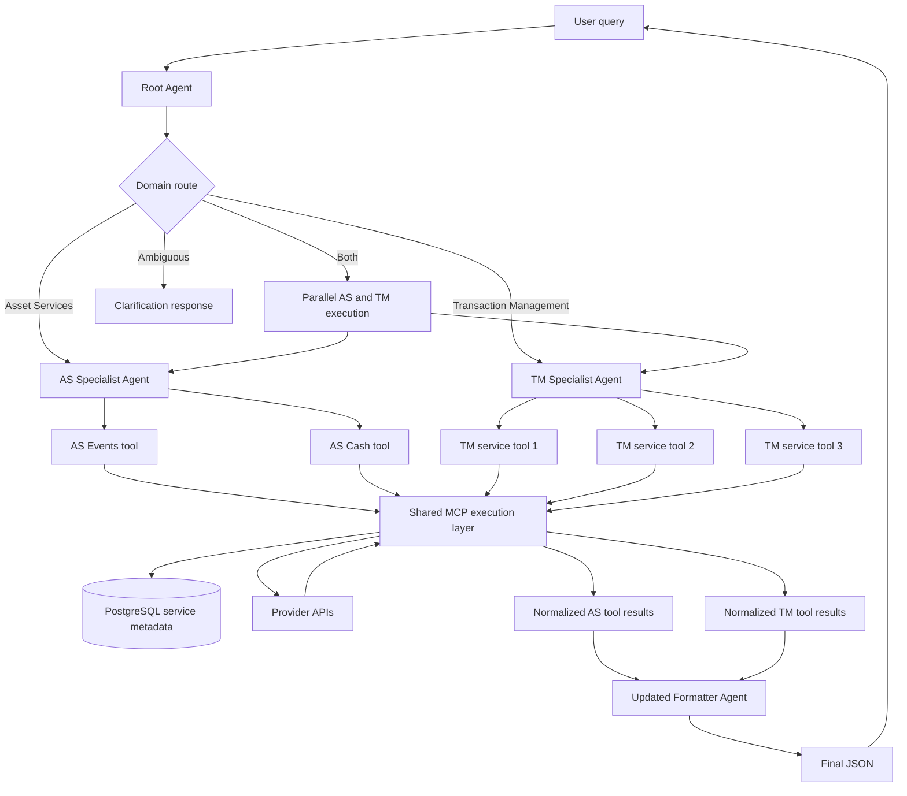

# Octobot Architecture Design

Date: 2026-08-31

## 1. Purpose

This document explains the current Octobot failures and proposes a direct domain-agent architecture:

```text
User
  -> Root Agent
      -> Asset Services Specialist -> 2 AS service tools
      -> Transaction Management Specialist -> 3 TM service tools
  -> structured AS/TM agent responses
  -> Updated Formatter Agent
  -> Final JSON
```

The proposed design exposes one specialized MCP tool for each of the five provider services. The two AS tools are visible only to the AS specialist, and the three TM tools are visible only to the TM specialist. All tools run on one MCP server and reuse the same metadata, validation, query, provider, error-handling, and response-normalization code.

## 2. Current Error Causes

### 2.1 `Unknown service`: service name and portable ID are mixed

The strongest direct cause is visible in `octobot_mcp/models/apigee.py`.

At lines 17-20, `service_portable_id` is required:

```python
# octobot_mcp/models/apigee.py:17-20
service_portable_id: str = Field(
    min_length=1,
    max_length=100,
    description="ServicePortableID of the target service, from the discovery call.",
)
```

At lines 22-29, `service_name` is optional and the description explicitly allows schema resolution from the portable ID:

```python
# octobot_mcp/models/apigee.py:22-29
service_name: str | None = Field(
    default=None,
    max_length=200,
    description=(
        "Optional service name (e.g. view_events_entitlements) used for schema "
        "validation. When omitted, the schema is resolved from "
        "service_portable_id."
    ),
)
```

The same behavior is exposed in the MCP tool.

```python
# octobot_mcp/tools/apigee_tools.py:69-79
async def apply_filters(
    service_portable_id: str,
    select: list[str],
    service_name: str | None = None,
    filters: list[str] | None = None,
    query: str | None = None,
    range_from: str | None = None,
    range_to: str | None = None,
    skip: int = 0,
    take: int = 5000,
    skip_count: bool = True,
) -> dict[str, Any]:
```

The tool instructions at `octobot_mcp/tools/apigee_tools.py:83-93` say that `service_name` is optional and that schema resolution falls back to `service_portable_id`.

The runtime path reported in the production trace is:

```text
octobot_mcp/tools/apigee_tools.py:135
  -> self._service.apply_filters(request)

octobot_mcp/services/apigee_service.py:272
  -> _validate_request_schema(...)

octobot_mcp/services/apigee_service.py:215
  -> get_service_schema(request.service_name or request.service_portable_id)

octobot_mcp/config/api_schema_registry.py:317
  -> ValueError: Unknown service
```

The failing identifier was:

```text
d3823c4c-88bf-4ad1-bafe-d99f527d36c8
```

The local registry reported only these logical schema names:

```text
view_cash_entitlements
view_events_entitlements
```

The defect is precise: a stable logical service name and a portable UUID are treated as interchangeable schema keys. They have different responsibilities:

```text
Logical service key
  -> identifies schema, columns, aliases, and required filters

Portable ID
  -> identifies the upstream provider service
```

A related observed mismatch is:

```text
Discovery name: view_api_octobot_events_entitlements
Registry name:  view_events_entitlements
```

The discovery implementation that emits the longer name was not supplied, so that exact source line still needs confirmation.

### 2.2 Too much API workflow is placed in the LLM-facing tool instructions

The MCP docstrings become instructions visible to the agent:

- `octobot_mcp/tools/apigee_tools.py:25-32` tells the model to call discovery, extract `ServicePortableID`, inspect `$select`, and discover columns.
- `octobot_mcp/tools/apigee_tools.py:42-62` tells the model to request a service dictionary and reason over column contracts, required filters, defaults, and aliases.
- `octobot_mcp/tools/apigee_tools.py:83-95` prescribes the exact three-step workflow.
- `octobot_mcp/tools/apigee_tools.py:98-121` exposes filter operators, null syntax, datetime formats, range behavior, and pagination.

The current effective workflow is:

```text
get_filter_values
  -> model selects service name and portable ID
  -> get_service_dictionary
  -> model selects exact columns and filters
  -> apply_filters
  -> local schema validation
  -> upstream provider
```

This gives the model too many opportunities to pass a stale UUID, a discovery name that does not match the registry, an invalid column, or an incomplete required filter set.

### 2.3 Upstream `500` details are flattened

The observed upstream failure path was:

```text
GET /api/services/c108015f-0605-4538-ba75-2d75316b8420/filter
  -> HTTP/1.1 500 Internal Server Error
  -> httpx.raise_for_status()
  -> ServiceUnavailableError: Upstream service error
  -> Error occurred during MCP tool execution
```

The trace points to `octobot_mcp/tools/apigee_tools.py:135` and approximately `octobot_mcp/services/apigee_service.py:275`. The complete exception-handler source was not supplied, so the exact catch/raise line cannot be cited safely.

The problem is not that the raw `500` always reaches the user. The problem is that useful context is lost:

- logical service
- provider status
- provider response details
- whether retry is appropriate
- which domain failed
- whether another domain succeeded

### 2.4 Current architecture issues

| Issue | Current effect | Required correction |
| --- | --- | --- |
| Logical name and portable ID are interchangeable | `Unknown service` before the provider is called | Resolve schemas only by canonical logical service key |
| Discovery and registry names can differ | Valid business intent fails on an exact string mismatch | Normalize aliases in deterministic tool code |
| Portable IDs participate in agent reasoning | A stale or incorrect provider identifier can be selected | Keep portable IDs inside metadata/tool code |
| Agent must reason over exact API mechanics | Long prompts and fragile discovery/dictionary calls | Expose one business-level tool per provider service |
| Provider failures lose structure | Generic MCP failure with weak diagnostics | Return normalized domain errors |
| Current tools expose generic discovery mechanics | Agents must pass service identifiers and API details manually | Replace them with five fixed, service-specific tools backed by shared code |

### 2.5 Immediate code fixes for the current implementation

These changes fix the current `get_filter_values -> get_service_dictionary -> apply_filters` implementation before the larger AS/TM domain-tool migration is complete.

#### Fix 1: make `service_name` required in the request model

File: `octobot_mcp/models/apigee.py`

Replace the optional field at approximately lines 22-29:

```python
service_name: str | None = Field(
    default=None,
    max_length=200,
    description=(
        "Optional service name used for schema validation. "
        "When omitted, the schema is resolved from service_portable_id."
    ),
)
```

with:

```python
service_name: str = Field(
    min_length=1,
    max_length=200,
    description=(
        "Stable service name returned by discovery. "
        "Used only for local schema validation; never use the portable ID."
    ),
)
```

This prevents a request from reaching schema validation without the stable name.

#### Fix 2: require `service_name` in the MCP tool

File: `octobot_mcp/tools/apigee_tools.py`

Change the function signature at approximately lines 69-79:

```python
async def apply_filters(
    service_portable_id: str,
    service_name: str,
    select: list[str],
    filters: list[str] | None = None,
    query: str | None = None,
    range_from: str | None = None,
    range_to: str | None = None,
    skip: int = 0,
    take: int = 5000,
    skip_count: bool = True,
) -> dict[str, Any]:
```

Update the tool description so it no longer says that `service_name` is optional or that a portable ID can resolve a schema:

```text
Call get_filter_values first and retain both values:

- Name: pass as service_name for schema validation.
- ServicePortableID: pass as service_portable_id for the provider URL.

service_name is required. Never pass ServicePortableID as service_name.
Call get_service_dictionary(service_name=Name) before apply_filters.
```

The existing request construction can remain named and explicit:

```python
request = ApplyFiltersRequest(
    service_portable_id=service_portable_id,
    service_name=service_name,
    select=select,
    filters=filters or [],
    query=query,
    range_from=range_from,
    range_to=range_to,
    skip=skip,
    take=take,
    skip_count=skip_count,
)
```

#### Fix 3: resolve schemas only from the logical service name

File: `octobot_mcp/services/apigee_service.py`

Replace the fallback at approximately line 215:

```python
schema = get_service_schema(
    request.service_name or request.service_portable_id
)
```

with:

```python
schema = get_service_schema(request.service_name)
```

Use the portable ID only when constructing the upstream path:

```python
path = f"/api/services/{request.service_portable_id}/filter"
```

Do not use `service_portable_id` in schema, column, alias, or required-filter lookup.

#### Fix 4: normalize discovery names in one place

File: `octobot_mcp/config/api_schema_registry.py`

Add aliases for the exact discovery names that represent the same logical schema:

```python
_SERVICE_NAME_ALIASES: dict[str, str] = {
    "view_events_entitlements": "view_events_entitlements",
    "view_api_octobot_events_entitlements": "view_events_entitlements",
    "view_cash_entitlements": "view_cash_entitlements",
    "view_api_octobot_cash_entitlements": "view_cash_entitlements",
}


def normalize_service_name(service_name: str) -> str:
    identifier = service_name.strip().lower()
    return _SERVICE_NAME_ALIASES.get(identifier, identifier)
```

Then make `get_service_schema` use only `_SCHEMA_BY_NAME`:

```python
def get_service_schema(service_name: str) -> ServiceSchema:
    canonical_name = normalize_service_name(service_name)
    schema = _SCHEMA_BY_NAME.get(canonical_name)

    if schema is None:
        raise ValueError(
            f"Unknown service name: {service_name!r}. "
            f"Canonical value: {canonical_name!r}. "
            f"Known services: {sorted(_SCHEMA_BY_NAME)}"
        )

    return schema
```

Remove this behavior from the normal lookup path:

```python
_SCHEMA_BY_PORTABLE_ID.get(...)
```

If it must remain temporarily for another caller, expose it through a separately named legacy function so `get_service_schema` cannot silently mix identifiers.

#### Fix 5: validate that discovery returns both identifiers

Before calling `apply_filters`, reject incomplete discovery results explicitly:

```python
def validate_discovered_service(service: dict[str, Any]) -> tuple[str, str]:
    service_name = str(service.get("Name") or "").strip()
    portable_id = str(service.get("ServicePortableID") or "").strip()

    if not service_name:
        raise ValueError("Discovery result is missing Name")
    if not portable_id:
        raise ValueError("Discovery result is missing ServicePortableID")

    return service_name, portable_id
```

Do not substitute one identifier for the other when either value is missing.

#### Fix 6: return structured upstream failures

Place this handling in the service method that owns the `httpx.Response` and calls `raise_for_status()`. Adapt logger argument names to the logging library already used by the repository.

```python
def classify_upstream_status(status_code: int) -> tuple[str, bool]:
    if status_code in {401, 403}:
        return "upstream_authentication_error", False
    if status_code == 429:
        return "upstream_rate_limited", True
    if status_code >= 500:
        return "upstream_unavailable", True
    return "upstream_rejected_request", False


def upstream_http_error_result(
    *,
    exc: httpx.HTTPStatusError,
    logical_service: str,
) -> dict[str, Any]:
    response = exc.response
    error_type, retryable = classify_upstream_status(response.status_code)
    correlation_id = (
        response.headers.get("x-correlation-id")
        or response.headers.get("x-request-id")
    )

    logger.error(
        "Upstream service request failed",
        extra={
            "logical_service": logical_service,
            "status_code": response.status_code,
            "request_path": response.request.url.path,
            "correlation_id": correlation_id,
            "response_body": response.text[:2000],
        },
    )

    return {
        "status": "UPSTREAM_ERROR",
        "data": [],
        "error": {
            "type": error_type,
            "message": "The upstream service could not complete the request.",
            "logical_service": logical_service,
            "provider_status": response.status_code,
            "retryable": retryable,
            "correlation_id": correlation_id,
        },
    }
```

Use it around the provider call:

```python
try:
    response = await client.get(...)
    response.raise_for_status()
except httpx.HTTPStatusError as exc:
    return upstream_http_error_result(
        exc=exc,
        logical_service=request.service_name,
    )
except httpx.TimeoutException:
    logger.exception(
        "Upstream service request timed out",
        extra={"logical_service": request.service_name},
    )
    return {
        "status": "UPSTREAM_ERROR",
        "data": [],
        "error": {
            "type": "upstream_timeout",
            "message": "The upstream service timed out.",
            "logical_service": request.service_name,
            "provider_status": None,
            "retryable": True,
            "correlation_id": None,
        },
    }
```

Do not return `response_body`, provider URLs, tokens, or stack traces to the agent. Keep those only in protected logs.

#### Fix 7: validate filter values before calling the provider

The earlier `500` example included a safe-account value resembling `4205640693 SN`. If `sfacntnm` is defined as numeric in the service dictionary, reject the value locally instead of sending malformed input upstream:

```python
def validate_numeric_filter(column_name: str, value: str) -> str:
    normalized = value.strip()
    if not normalized.isdigit():
        raise ValueError(
            f"Invalid value for {column_name}: expected digits only"
        )
    return normalized
```

Apply this through schema metadata rather than hardcoding only `sfacntnm`: numeric dictionary fields use numeric validation, date/timestamp fields use date parsing, and string fields retain their string value. Do not silently remove unknown suffixes such as `SN` unless the provider contract explicitly defines that transformation.

#### Fix 8: deploy these current-flow changes together

Making `service_name` required changes the MCP tool schema. Deploy these items in one release:

1. Request-model change.
2. MCP tool signature and description change.
3. Service-layer schema lookup change.
4. Registry alias normalization.
5. Prompt/tool-call update that supplies both `Name` and `ServicePortableID`.

After the five specialized tools are introduced, specialist agents will no longer supply either identifier. Each tool is bound to a stable `service_key`, and the shared executor resolves that service's portable ID from PostgreSQL metadata internally.

### 2.6 Regression tests for the fixes

Add focused tests for these behaviors:

```python
def test_apply_filters_requires_service_name():
    with pytest.raises(ValidationError):
        ApplyFiltersRequest(
            service_portable_id="d3823c4c-88bf-4ad1-bafe-d99f527d36c8",
            select=["corp"],
        )


def test_discovery_alias_resolves_to_canonical_schema():
    alias_schema = get_service_schema("view_api_octobot_events_entitlements")
    canonical_schema = get_service_schema("view_events_entitlements")
    assert alias_schema == canonical_schema


def test_portable_id_is_not_a_schema_key():
    with pytest.raises(ValueError, match="Unknown service name"):
        get_service_schema("d3823c4c-88bf-4ad1-bafe-d99f527d36c8")


def test_numeric_filter_rejects_suffix():
    with pytest.raises(ValueError, match="expected digits only"):
        validate_numeric_filter("sfacntnm", "4205640693 SN")
```

For the provider-error test, mock an `httpx.Response` with status `500` and assert that the returned result contains `status=UPSTREAM_ERROR`, `provider_status=500`, and `retryable=True`, while excluding the raw response body and request URL.

## 3. Proposed Architecture

The proposed architecture contains one root agent, two specialist agents, five specialized service tools on one MCP server, a PostgreSQL metadata source, and an updated formatter agent that accepts structured specialist responses directly.

### 3.1 Responsibilities

| Component | Responsibility | Must not own |
| --- | --- | --- |
| Root Agent | Identify whether the request belongs to AS, TM, both, or needs clarification | Portable IDs, endpoints, columns, provider selection |
| AS Specialist | Understand Asset Services intent and select one or both AS tools | Portable IDs, exact columns, or query construction |
| TM Specialist | Understand Transaction Management intent and select one or more of the three TM tools | Portable IDs, exact columns, or query construction |
| Five Service Tools | Execute one fixed provider service per tool through the shared executor | Cross-domain routing or user-facing formatting |
| Shared MCP Execution Layer | Load metadata, validate inputs, build provider requests, call providers, and normalize results | Selecting the user's business intent |
| PostgreSQL Metadata | Hold service mappings and API metadata used by tools | Agent execution logic |
| Formatter Agent | Accept one or more structured specialist responses, merge and format them, and produce the unchanged final JSON structure | Tool calls or data retrieval |

### 3.2 Core design rule

```text
Agents decide:
  - business intent
  - domain
  - business entities
  - which permitted specialized service tool or tools are required
  - whether clarification is needed

Each service tool and shared code decide:
  - the tool's fixed logical service key
  - portable ID
  - exact columns
  - exact filters
  - aliases
  - endpoint
  - authentication
  - query construction
  - retries
  - error normalization
```

The agent selects a tool by its business purpose, never by UUID. Portable IDs must never be sent to the root, AS specialist, TM specialist, or formatter.

## 4. Mermaid Flow Diagram



## 5. Root Agent

The root agent performs business-domain routing only.

### 5.1 Route categories

```text
ASSET_SERVICES
TRANSACTION_MANAGEMENT
BOTH
NEEDS_CLARIFICATION
OUT_OF_SCOPE
```

### 5.2 Root output contract

```json
{
  "route": "ASSET_SERVICES",
  "reason": "The request asks for corporate action events and entitlements.",
  "entities": {
    "corp": "2026635491",
    "safe_account": "4205640693"
  },
  "missing_inputs": []
}
```

The root output uses domain names and business entities only. It must not contain service names, portable IDs, table names, API columns, endpoint paths, or provider adapter names.

### 5.3 Routing guidance

Route to Asset Services for concepts such as:

- corporate actions
- events and event status
- cash or security entitlements
- safe accounts
- payment, record, or ex dates related to asset servicing

Route to Transaction Management for concepts such as:

- transaction status or history
- settlement activity
- failed, pending, cancelled, or completed transactions
- transaction exceptions
- transaction identifiers and lifecycle data

Route to both when one answer requires both asset-servicing facts and transaction activity.

Ask for clarification when terms such as `status`, `activity`, or `account information` do not provide enough context to select a domain safely.

### 5.4 Root prompt

```text
You are the Octobot root routing agent.

Classify the request as ASSET_SERVICES, TRANSACTION_MANAGEMENT, BOTH,
NEEDS_CLARIFICATION, or OUT_OF_SCOPE.

Extract only business entities explicitly present in the request.
Do not select services, portable IDs, endpoints, columns, or providers.
Do not answer the business question.
Return only the route decision in the required structured format.
```

## 6. Asset Services Specialist

The AS specialist receives AS-related requests and can see exactly two specialized tools:

```text
query_as_events_entitlements
query_as_cash_entitlements
```

Each tool maps to one AS `service_key` and one portable ID. The specialist selects one or both tools by business purpose; it never receives or passes the portable ID.

### 6.1 AS specialist prompt

```text
You are the Octobot Asset Services specialist.

Handle requests about corporate actions, events, cash entitlements,
security entitlements, safe accounts, and related Asset Services data.

You have access only to the two Asset Services tools. Select the events tool,
the cash-entitlements tool, or both according to the user's business request.
Call both tools when the answer requires event details and resulting entitlement
details. Independent calls may run in parallel.

Pass only business entities, filters, requested information, and time constraints.
Never pass or invent service names, portable IDs, endpoints, or provider columns.
Use only returned tool data. If required business input is missing, return a
clarification request. Return one structured Asset Services response containing
every tool result.
```

### 6.2 Common service-tool input

All five tools use the same business-level request envelope where practical. A specialized tool may narrow this schema for its own supported filters.

```json
{
  "entities": {
    "corp": "2026635491",
    "safe_account": "4205640693"
  },
  "filters": {
    "time_constraint": "upcoming"
  },
  "requested_information": [
    "event_type",
    "pay_date",
    "status"
  ],
  "pagination": {
    "skip": 0,
    "take": 500
  }
}
```

The input does not contain `service_key`, `service_name`, or `portable_id`. Those values are fixed by the selected tool and resolved internally.

### 6.3 Multiple AS services for one query

For a request such as "show the corporate action event and its resulting cash entitlement," the AS specialist:

1. Calls `query_as_events_entitlements`.
2. Calls `query_as_cash_entitlements`.
3. Keeps both normalized results under `serviceResults`.
4. Returns one structured AS response to the formatter.

The calls run in parallel when they depend only on user-provided entities. If the second call needs a key returned by the first, the specialist calls them sequentially and passes only that business key into the second tool.

## 7. Transaction Management Specialist

The TM specialist receives TM-related requests and can see exactly three specialized tools. The first service name is known from the supplied workbook; the other two registered names must use their approved business service names when those workbooks are loaded.

```text
query_tm_current_securities_transactions
query_tm_<service_2_business_name>
query_tm_<service_3_business_name>
```

Do not use portable UUIDs in MCP tool names. Tool names remain stable business contracts even if provider metadata is refreshed.

### 7.1 TM specialist prompt

```text
You are the Octobot Transaction Management specialist.

Handle requests about transactions, transaction status, settlement,
exceptions, failures, pending activity, and transaction history.

You have access only to the three Transaction Management tools. Select the
smallest set of tools that fully answers the user's request. Call multiple
tools when the requested facts span multiple TM services. Independent calls
may run in parallel; dependent calls must run in the required order.

Pass only business entities, filters, requested information, and time constraints.
Never pass or invent service names, portable IDs, endpoints, or provider columns.
Use only returned tool data. If required business input is missing, return a
clarification request. Return one structured Transaction Management response
containing every tool result.
```

### 7.2 Example TM tool input

```json
{
  "entities": {
    "safe_account": "4205640693"
  },
  "filters": {
    "transaction_status": ["FAILED"],
    "business_date": "yesterday"
  },
  "requested_information": [
    "transaction_id",
    "status",
    "amount",
    "settlement_date"
  ]
}
```

### 7.3 One tool per service

Each registered tool is a thin wrapper around the same executor:

```python
@mcp.tool()
async def query_tm_current_securities_transactions(
    request: ServiceQueryRequest,
) -> ServiceQueryResult:
    return await execute_service_query(
        service_key="TM_CURRENT_SECURITIES_TRANSACTIONS",
        request=request,
    )
```

The wrapper fixes the `service_key`; the agent cannot override it. `execute_service_query` performs the same deterministic steps for every service:

1. Load the service row and portable ID by `service_key`.
2. Load that service's column dictionary.
3. Resolve business aliases to provider columns.
4. Validate required filters and data types.
5. Select only permitted output columns.
6. Build and execute the provider request.
7. Normalize records, pagination, warnings, and errors.

### 7.4 Shared MCP server and repository

All five tools are registered on one MCP server and share common modules:

```text
octobot_mcp/
  tools/
    as_events_entitlements.py
    as_cash_entitlements.py
    tm_current_securities_transactions.py
    tm_service_2.py
    tm_service_3.py
  core/
    service_executor.py
    request_validator.py
    query_builder.py
    response_normalizer.py
  metadata/
    service_repository.py
    column_repository.py
  providers/
    apigee_client.py
```

The five tool modules should contain only the registered tool name, description, input contract, fixed `service_key`, and any genuinely service-specific transformation. Authentication, metadata access, query construction, retries, logging, and error normalization belong in shared modules and must not be copied across tools.

### 7.5 Tool visibility

| Agent | Visible tools |
| --- | --- |
| Root Agent | None |
| AS Specialist | `query_as_events_entitlements`, `query_as_cash_entitlements` |
| TM Specialist | `query_tm_current_securities_transactions` and the two remaining approved TM service tools |
| Formatter Agent | None |

This visibility boundary prevents an AS request from calling a TM service directly and keeps each specialist's tool-selection scope small.

## 8. PostgreSQL Metadata Scope

The five provider services across the two domains can be represented with two metadata tables. Because each portable ID works in every environment, there is no service-deployment mapping to model.

```text
octobot_service
  5 service rows: 2 AS + 3 TM
       |
       +--< octobot_service_column
              one row per dictionary column
```

No separate tables are needed for domains, aliases, account types, or uncommon spreadsheet fields. Tool selection belongs in the five registered tool descriptions and specialist prompts, not in another routing table.

### 8.1 Table 1: `octobot_service`

This table represents a provider service and contains its globally valid portable ID. It stores the fields shown on the `SERVICE` sheet plus the minimal routing and provider metadata required by the AS and TM tools.

```sql
CREATE TABLE octobot_service (
    service_id BIGINT GENERATED ALWAYS AS IDENTITY PRIMARY KEY,

    -- Stable Octobot identity used by tool code.
    service_key TEXT NOT NULL UNIQUE,
    business_domain TEXT NOT NULL CHECK (
        business_domain IN ('ASSET_SERVICES', 'TRANSACTION_MANAGEMENT')
    ),

    -- Fields imported from the SERVICE sheet.
    catalog TEXT NOT NULL,
    portable_id UUID NOT NULL UNIQUE,
    source_name TEXT NOT NULL,
    english_name TEXT NOT NULL,
    description TEXT,
    service_type TEXT,
    data_entitlement_model_type TEXT,
    filter_query TEXT,
    account_types TEXT[] NOT NULL DEFAULT '{}',
    source_domain TEXT,
    source_subdomain TEXT,
    dataset TEXT,

    -- Alternate provider/discovery names for the same service.
    aliases TEXT[] NOT NULL DEFAULT '{}',

    endpoint_path TEXT NOT NULL DEFAULT '/api/services/{portable_id}/filter',
    provider_settings JSONB NOT NULL DEFAULT '{}'::jsonb,

    is_active BOOLEAN NOT NULL DEFAULT TRUE,
    extra_metadata JSONB NOT NULL DEFAULT '{}'::jsonb,
    created_at TIMESTAMPTZ NOT NULL DEFAULT now(),
    updated_at TIMESTAMPTZ NOT NULL DEFAULT now(),

    UNIQUE (catalog, source_name)
);

CREATE INDEX octobot_service_domain_idx
    ON octobot_service (business_domain, is_active);

CREATE INDEX octobot_service_aliases_gin_idx
    ON octobot_service USING GIN (aliases);
```

Important distinction: the spreadsheet `Domain` value can be `Unspecified`, as shown in the screenshot. It is therefore stored as `source_domain`. `business_domain` is the explicit Octobot routing value and must be either Asset Services or Transaction Management.

### 8.2 Table 2: `octobot_service_column`

This table represents the `DICTIONARIES` sheet. `Catalog`, `Service`, and `Portable Id` are used during import to locate `service_id`; they are not repeated in every stored column row.

```sql
CREATE TABLE octobot_service_column (
    service_column_id BIGINT GENERATED ALWAYS AS IDENTITY PRIMARY KEY,
    service_id BIGINT NOT NULL REFERENCES octobot_service(service_id)
        ON DELETE CASCADE,

    original_column_name TEXT NOT NULL,
    english_column_name TEXT,
    column_description TEXT,
    data_type TEXT NOT NULL,
    column_order INTEGER NOT NULL CHECK (column_order > 0),

    is_trusted BOOLEAN NOT NULL DEFAULT FALSE,
    is_default_output BOOLEAN NOT NULL DEFAULT FALSE,
    is_critical_data_element BOOLEAN NOT NULL DEFAULT FALSE,
    critical_data_element_category TEXT,
    is_grain BOOLEAN NOT NULL DEFAULT FALSE,
    grain_type TEXT,
    is_key BOOLEAN NOT NULL DEFAULT FALSE,
    sort_order INTEGER,
    is_output_column BOOLEAN NOT NULL DEFAULT FALSE,
    is_calculated_column BOOLEAN NOT NULL DEFAULT FALSE,
    is_client_code_column BOOLEAN NOT NULL DEFAULT FALSE,
    is_parameter BOOLEAN NOT NULL DEFAULT FALSE,
    is_range BOOLEAN NOT NULL DEFAULT FALSE,
    is_required_filter BOOLEAN NOT NULL DEFAULT FALSE,
    filter_group_number INTEGER,
    partition_key_index INTEGER,
    is_partitioning_field BOOLEAN NOT NULL DEFAULT FALSE,
    expression TEXT,

    -- Business terms such as safe_account for sfacntnm.
    aliases TEXT[] NOT NULL DEFAULT '{}',

    -- Preserves future spreadsheet fields without another migration/table.
    extra_metadata JSONB NOT NULL DEFAULT '{}'::jsonb,
    created_at TIMESTAMPTZ NOT NULL DEFAULT now(),
    updated_at TIMESTAMPTZ NOT NULL DEFAULT now(),

    UNIQUE (service_id, original_column_name),
    UNIQUE (service_id, column_order)
);

CREATE INDEX octobot_service_column_required_idx
    ON octobot_service_column (service_id, column_order)
    WHERE is_required_filter = TRUE;

CREATE INDEX octobot_service_column_default_idx
    ON octobot_service_column (service_id, column_order)
    WHERE is_default_output = TRUE;

CREATE INDEX octobot_service_column_aliases_gin_idx
    ON octobot_service_column USING GIN (aliases);
```

### 8.3 Spreadsheet-to-table mapping

`SERVICE` sheet mapping:

| Spreadsheet column | PostgreSQL target |
| --- | --- |
| `Catalog` | `octobot_service.catalog` |
| `Portable Id` | `octobot_service.portable_id` |
| `Name` | `octobot_service.source_name` |
| `English Name` | `octobot_service.english_name` |
| `Description` | `octobot_service.description` |
| `Type` | `octobot_service.service_type` |
| `Data Entitlement Model Type` | `octobot_service.data_entitlement_model_type` |
| `Filter Query` | `octobot_service.filter_query` |
| `Account Types` | `octobot_service.account_types` |
| `Domain` | `octobot_service.source_domain` |
| `Subdomain` | `octobot_service.source_subdomain` |
| `Dataset` | `octobot_service.dataset` |

`DICTIONARIES` sheet mapping:

| Spreadsheet columns | PostgreSQL target |
| --- | --- |
| `Catalog`, `Service`, `Portable Id` | Resolve the parent `service_id`; do not duplicate them |
| `Original Column Name` through `Expression` | Corresponding typed columns in `octobot_service_column` |
| Future or rarely used fields | `octobot_service_column.extra_metadata` |

Blank spreadsheet booleans should be normalized to `FALSE` during import. Blank text and number cells should become `NULL`, not empty strings or zero unless zero is the actual source value.

### 8.4 Example using the supplied service

The screenshots show this Transaction Management service:

```sql
INSERT INTO octobot_service (
    service_key,
    business_domain,
    catalog,
    portable_id,
    source_name,
    english_name,
    description,
    service_type,
    data_entitlement_model_type,
    account_types,
    source_domain,
    source_subdomain,
    dataset,
    aliases
) VALUES (
    'TM_CURRENT_SECURITIES_TRANSACTIONS',
    'TRANSACTION_MANAGEMENT',
    'CDS2_RT',
    'fdbc0b64-8bb3-46e2-b4fa-dccccd4cc377'::uuid,
    'TCD2_JOINS_IOD',
    'Current Securities Transactions',
    'Provides recent securities transaction activity for each safekeeping account.',
    'database',
    'CDS',
    ARRAY['S', 'K'],
    'Unspecified',
    'Unspecified',
    'Unspecified',
    ARRAY[
        'TCD2_JOINS_IOD',
        'Current Securities Transactions'
    ]
);
```

Example dictionary column from the screenshots:

```sql
INSERT INTO octobot_service_column (
    service_id,
    original_column_name,
    english_column_name,
    column_description,
    data_type,
    column_order,
    is_trusted,
    is_default_output,
    is_output_column
)
SELECT
    service_id,
    'ACTVTY_TYP_SEQ',
    'Activity Type Sequence',
    'Activity Type Sequence',
    'int',
    13,
    FALSE,
    TRUE,
    TRUE
FROM octobot_service
WHERE service_key = 'TM_CURRENT_SECURITIES_TRANSACTIONS';
```

### 8.5 How each specialized tool retrieves its service

Each registered MCP tool passes its fixed `service_key` to the shared metadata repository. The SQL returns exactly one active service; neither the agent nor the request can substitute another service or portable ID.

```sql
SELECT
    s.service_id,
    s.service_key,
    s.business_domain,
    s.portable_id,
    s.endpoint_path,
    s.provider_settings
FROM octobot_service AS s
WHERE s.service_key = $1
  AND s.is_active = TRUE
LIMIT 1;
```

For every selected service, the tool loads its query contract:

```sql
SELECT
    original_column_name,
    english_column_name,
    data_type,
    column_order,
    aliases,
    is_default_output,
    is_required_filter,
    filter_group_number,
    is_parameter,
    is_range,
    expression
FROM octobot_service_column
WHERE service_id = $1
  AND (is_output_column = TRUE OR is_required_filter = TRUE)
ORDER BY column_order;
```

When one user query needs several services, the specialist calls several registered tools. Each tool independently executes this lookup and returns the same normalized result contract.

### 8.6 Why two tables are enough

- `octobot_service` holds five services, their portable IDs, and their provider metadata.
- `octobot_service_column` holds the full column dictionary shown in the screenshots.
- No separate domain, intent, alias, dependency, account-type, or flag tables.
- `extra_metadata` preserves future source fields without immediately changing the schema.

Expected row counts:

| Table | Expected scale |
| --- | --- |
| `octobot_service` | Exactly 5 initial rows: 2 AS and 3 TM |
| `octobot_service_column` | Sum of all dictionary rows across the 5 services |

### 8.7 What remains outside PostgreSQL service metadata

Keep these deployment concerns in Helm, environment variables, or secret mounts:

- deployment environment
- provider base URL
- authentication URL and scope
- credential and certificate paths
- PostgreSQL connection information
- network timeout defaults
- observability endpoints

Do not keep individual AS or TM portable IDs in prompts or Helm values when they can be resolved from service metadata.

## 9. Structured Specialist Response

All five service tools return the same normalized result contract, and both specialists expose the same final-response envelope to the formatter. This prevents the formatter from depending on provider-specific response shapes.

```json
{
  "domain": "ASSET_SERVICES",
  "status": "SUCCESS",
  "intent": "get_upcoming_corporate_action_events",
  "toolsUsed": ["query_as_events_entitlements"],
  "serviceResults": [
    {
      "logicalService": "AS_EVENTS",
      "status": "SUCCESS",
      "tables": [],
      "attributes": {},
      "error": null
    }
  ],
  "tables": [
    {
      "columns": ["corp", "event_type", "pay_date", "status", "sfacntnm"],
      "rows": []
    }
  ],
  "attributes": {
    "recordCount": 0
  },
  "missingInputs": [],
  "warnings": [],
  "errors": []
}
```

Portable IDs, provider URLs, access tokens, and stack traces are not included.

Supported statuses:

```text
SUCCESS
PARTIAL
NO_DATA
NEEDS_CLARIFICATION
UPSTREAM_ERROR
CONFIGURATION_ERROR
INVALID_REQUEST
```

## 10. Updated Formatter Agent

The formatter is updated to accept the raw structured final responses from the AS and TM specialists. It no longer receives or parses `{octobot_raw}` markdown. The final formatter output structure remains unchanged.

```text
AS specialist final response ----+
                                 +-> Formatter Agent -> existing final JSON
TM specialist final response ----+
```

For a single-domain request, the formatter receives one specialist response. For a `BOTH` request, it receives both responses in the same input array.

### 10.1 Formatter input contract

```json
{
  "userQuery": "Show upcoming corporate actions and related transaction activity.",
  "route": "BOTH",
  "agentResults": [
    {
      "domain": "ASSET_SERVICES",
      "status": "SUCCESS",
      "intent": "get_upcoming_corporate_action_events",
      "toolsUsed": ["query_as_events_entitlements"],
      "serviceResults": [],
      "tables": [],
      "attributes": {},
      "missingInputs": [],
      "warnings": [],
      "errors": []
    },
    {
      "domain": "TRANSACTION_MANAGEMENT",
      "status": "SUCCESS",
      "intent": "get_related_transaction_activity",
      "toolsUsed": ["query_tm_current_securities_transactions"],
      "serviceResults": [],
      "tables": [],
      "attributes": {},
      "missingInputs": [],
      "warnings": [],
      "errors": []
    }
  ]
}
```

The input can be exposed to the formatter prompt as one variable such as `{agent_results}`.

### 10.2 Specialist final-response contract

Both specialists use the same response structure. When a specialist calls multiple service tools, it keeps each service outcome under `serviceResults` while also providing consolidated domain tables.

```json
{
  "domain": "ASSET_SERVICES",
  "status": "SUCCESS",
  "intent": "get_event_with_cash_entitlement",
  "toolsUsed": [
    "query_as_events_entitlements",
    "query_as_cash_entitlements"
  ],
  "serviceResults": [
    {
      "logicalService": "AS_EVENTS",
      "status": "SUCCESS",
      "tables": [],
      "attributes": {},
      "error": null
    },
    {
      "logicalService": "AS_CASH",
      "status": "SUCCESS",
      "tables": [],
      "attributes": {},
      "error": null
    }
  ],
  "tables": [],
  "attributes": {},
  "missingInputs": [],
  "warnings": [],
  "errors": []
}
```

The specialists do not create the user-facing final JSON. They return factual domain results in this common structure. All presentation and final-schema formatting belongs to the formatter.

### 10.3 Formatter responsibilities

The formatter:

- reads one or more structured specialist responses
- combines `toolsUsed` without duplicates
- preserves all domain and service tables
- assigns stable table IDs such as `table_1`, `table_2`, and `table_3`
- preserves column order, header casing, every row, and every cell
- converts domain attributes to the existing final `attributes` array
- combines missing inputs and clarification candidates
- represents warnings and partial failures without discarding successful data
- calculates the overall final status from the domain statuses
- returns `null` where information is unavailable
- uses only facts present in the specialist responses
- does not call tools
- returns one JSON object with no surrounding prose

The existing final output shape remains the same:

```json
{
  "intent": "Retrieve corporate action events and related transaction activity.",
  "toolsUsed": [
    "query_as_events_entitlements",
    "query_tm_current_securities_transactions"
  ],
  "tables": [
    {
      "id": "table_1",
      "columns": ["corp", "event_type", "status"],
      "rows": [
        {"cells": ["2026635491", "Dividend", "OPEN"]}
      ]
    }
  ],
  "attributes": [
    {"key": "asset_services_status", "value": "SUCCESS"},
    {"key": "transaction_management_status", "value": "SUCCESS"}
  ],
  "status": "SUCCESS",
  "options": []
}
```

### 10.4 Formatter status rules

| Specialist outcomes | Final status | Formatter behavior |
| --- | --- | --- |
| All requested domains succeed | `SUCCESS` | Include every table and attribute |
| One domain succeeds and another fails | `PARTIAL` | Preserve successful data and add failed-domain attributes |
| Required input is missing | `NEEDS_CLARIFICATION` | Populate `options` from specialist candidates |
| All requested domains return no records | `NO_DATA` | Return empty tables without inventing rows |
| All requested domains fail | `ERROR` | Return normalized failure information with no provider internals |

### 10.5 Updated formatter prompt

```text
You are the Octobot response formatter. You do not call tools.

You receive {agent_results}, containing the user query, selected route, and
one or more structured final responses from the Asset Services and
Transaction Management specialists.

Convert these responses into one JSON object that strictly matches the
existing Octobot final output schema.

Preserve every table, column, row, cell, ID, status, date, total, warning,
missing input, and error exactly as provided. Do not invent values.

When multiple domain or service results are present, include all tables and
assign stable sequential table IDs. Combine tool names without duplicates.

If one domain succeeds and another fails, preserve the successful data and
set the overall status to PARTIAL. If clarification candidates are present,
set status to NEEDS_CLARIFICATION and populate options.

Return one JSON object and no additional prose.
```

## 11. Tools Repository Boundary

The separate tools repository owns:

- MCP server setup
- five registered service-specific MCP tool wrappers
- the shared service executor used by all five tools
- AS and TM service-specific transformations where required
- shared AS and TM provider clients
- metadata access code
- authentication and certificate handling
- query construction and validation
- retries and timeouts
- normalized result and error mapping
- tests

The tools repository does not own:

- Root Agent behavior
- AS or TM specialist behavior
- formatter behavior
- user-facing response composition

The public boundary is five logical MCP tool contracts, each mapped one-to-one to a stable `service_key`. The portable ID remains metadata and is never part of the tool name or input. Common execution behavior remains internal to the MCP repository and is reused by every tool.

## 12. Example Query Flows

### 12.1 Asset Services only

User:

```text
Show upcoming corporate action events for corp 2026635491 and safe account 4205640693.
```

Flow:

1. Root routes to `ASSET_SERVICES`.
2. AS specialist extracts the corporate-action intent and business entities.
3. AS specialist selects `query_as_events_entitlements` from the tool description.
4. The tool wrapper passes fixed key `AS_EVENTS` to the shared executor.
5. The shared executor loads the service's portable ID and schema metadata.
6. It resolves `safe_account` to `sfacntnm`, validates filters, and calls the provider.
7. The specialized tool returns a normalized result.
8. AS specialist returns its structured final response.
9. Formatter converts the structured response to the existing final JSON.

### 12.2 Transaction Management only

User:

```text
Show failed transactions for safe account 4205640693 from yesterday.
```

Flow:

1. Root routes to `TRANSACTION_MANAGEMENT`.
2. TM specialist extracts status, account, and date constraints.
3. TM specialist selects the required subset of its three visible service tools.
4. It calls `query_tm_current_securities_transactions` and any other required TM tools.
5. Each tool resolves its own portable ID and provider fields through the shared executor.
6. The tools return normalized service results.
7. TM specialist returns its structured final response.
8. Formatter converts the structured response to the existing final JSON.

### 12.3 Both domains in parallel

User:

```text
For safe account 4205640693, show upcoming corporate actions and any related transaction activity.
```

Flow:

1. Root returns `BOTH`.
2. AS and TM specialists run independently in parallel.
3. AS calls one or both of its two service tools.
4. TM calls one or more of its three service tools.
5. Every selected tool resolves its fixed service through the shared executor.
6. Each specialist returns its structured final response after its domain calls complete or fail.
7. Formatter receives both responses in `agentResults`.
8. Formatter merges and formats them into one final JSON response.

### 12.4 Clarification

User:

```text
Show my entitlement information.
```

If no account or corporation can be inferred safely, the AS result is:

```json
{
  "domain": "ASSET_SERVICES",
  "status": "NEEDS_CLARIFICATION",
  "missing_inputs": [
    {
      "field": "safe_account",
      "message": "Safe account is required.",
      "candidates": []
    }
  ]
}
```

The formatter reads `missingInputs` directly from the specialist response and returns `NEEDS_CLARIFICATION` with any available options.

## 13. Error Handling

All tool failures use a stable error shape:

```json
{
  "status": "UPSTREAM_ERROR",
  "domain": "TRANSACTION_MANAGEMENT",
  "error": {
    "type": "upstream_unavailable",
    "message": "Transaction Management service is temporarily unavailable.",
    "logical_service": "TM_TRANSACTION_STATUS",
    "provider_status": 500,
    "retryable": true,
    "correlation_id": "corr_123"
  }
}
```

Rules:

- Do not expose tokens, credentials, internal URLs, or stack traces.
- Preserve provider status and correlation ID in logs.
- Distinguish invalid input, metadata/configuration failure, timeout, authentication failure, and upstream failure.
- Do not retry schema errors or missing required inputs.
- Retry only errors classified as transient.
- Preserve successful domain data when another domain fails.

## 14. Implementation Direction

Implement the architecture incrementally:

1. Introduce stable logical service keys for the two AS and three TM capabilities.
2. Move portable-ID resolution and service aliases behind a metadata access layer.
3. Change schema lookup so it never falls back from logical name to portable ID.
4. Implement one shared `execute_service_query` path for metadata lookup, validation, provider calls, and normalization.
5. Register two AS wrappers and bind each wrapper to one AS `service_key`.
6. Register three TM wrappers and bind each wrapper to one TM `service_key`.
7. Configure the AS and TM specialist tool allowlists separately.
8. Normalize all five tool result contracts.
9. Add root routing for AS, TM, both, clarification, and out-of-scope requests.
10. Update the formatter input contract to accept structured specialist responses directly.
11. Keep the existing formatter final-output schema unchanged.
12. Add parallel execution for independent multi-tool and `BOTH` queries.
13. Add tests for tool-to-service binding, service aliases, portable-ID lookup, required filters, multiple-service results, partial failures, and formatter compatibility.

## 15. Target End State

```text
Root Agent
  Routes business intent only.

AS Specialist
  Sees and calls only the two AS service tools.

TM Specialist
  Sees and calls only the three TM service tools.

Five Service-Specific MCP Tools
  Each tool is bound to one logical service key and one metadata-resolved
  portable ID. The specialists select tools by business purpose.

Shared MCP Execution Layer
  Reuses metadata lookup, schema validation, query construction, provider
  execution, retries, logging, and normalized errors across all five tools.

PostgreSQL Service Metadata
  Holds service mappings, portable IDs, columns, aliases, and filter rules.
  No agent-table design is prescribed in this document.

Updated Formatter Agent
  Consumes structured AS/TM specialist responses directly.
  Performs merging, table construction, status handling, and formatting.
  Returns the existing required final JSON structure.

Tools Repository
  Contains tool and provider code, not agent behavior.
```

This architecture keeps the original Root + AS + TM + Formatter design, exposes five specialized service tools with domain-restricted visibility, removes portable IDs from agent inputs, and reuses one implementation path across the single MCP server and repository.
