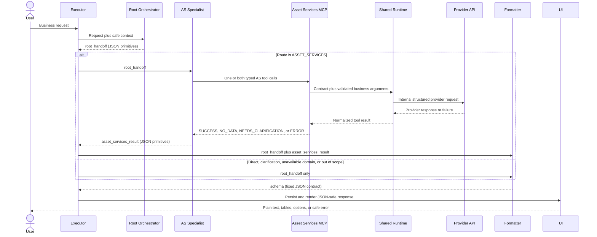

# Octobot MCP API and Function Flow

Date: 2026-09-07

Status: current Asset Services implementation and current three-agent prompt flow

Related artifacts:

- [Current architecture diagram](Octobot_High_Level_Architecture.svg)
- [Request flow code walkthrough](Octobot_AS_Request_Flow_Code_Walkthrough.md)
- [Root Orchestrator prompt](Octobot_Root_Orchestrator_System_Prompt.yaml)
- [Asset Services Specialist prompt](Octobot_Asset_Services_Specialist_System_Prompt.yaml)
- [Final Response Formatter prompt](Octobot_Final_Response_Formatter_System_Prompt.yaml)

## 1. Scope and evidence boundary

This document describes the current Asset Services implementation reconciled from
the latest supplied code reports, prompt files, and end-to-end evidence. It does
not treat older target-design examples as implemented behavior.

Current production scope:

- one Root Orchestrator;
- one Asset Services Specialist;
- one Final Response Formatter;
- two registered Asset Services MCP tools;
- one shared provider-query foundation;
- code-defined service contracts;
- no runtime metadata database;
- no Transaction Management tools in this release.

The external Root -> Asset Services Specialist -> Formatter end-to-end run was
still in progress when this document was updated. In-repository tests and lint
were reported clean, but this document does not claim that the external run has
passed until its final result is available.

Provider portable IDs, provider column names, URLs, credentials, and deployment
secrets are deliberately omitted.

## 2. Current architecture decisions

| Decision | Current rule |
|---|---|
| Agent model | Root Orchestrator -> domain Specialist -> Final Response Formatter |
| Executable domain | Asset Services only |
| Active MCP tools | `query_as_events_entitlements`, `query_as_cash_entitlements` |
| Future domain | Transaction Management, not registered or callable today |
| Tool shape | Explicit typed tool per business service |
| Internal reuse | Shared contracts, validation, request building, provider client, normalization |
| Contract source | Checked-in Python in `octobot_mcp/contracts/asset_services.py` |
| Runtime metadata | No PostgreSQL or metadata-loader dependency |
| Agent-visible fields | Business parameter names and approved business output keys only |
| Provider details | Internal to the MCP service |
| Agent result cap | 100 records per call |
| Provider transport ceiling | 400000 records internally; not agent-selectable |
| Filter operators | Equality only; no operator parameter is exposed |
| Correlation ID | Read from request context or middleware, never supplied by the agent |
| Final presentation | JSON output with plain text and structured tables; no HTML |

## 3. Active component inventory

### 3.1 Agents

| Component | Input | Responsibility | Output |
|---|---|---|---|
| Root Orchestrator | User request and safe conversation context | Classify intent and choose one route | `root_handoff` |
| Asset Services Specialist | `root_handoff` | Validate business inputs, choose one or both AS tools, normalize tool results | `asset_services_result` |
| Final Response Formatter | `root_handoff` and optional `asset_services_result` | Produce the fixed UI response contract | `schema` |

### 3.2 Registered MCP tools

| Tool | Purpose | State |
|---|---|---|
| `query_as_events_entitlements` | Corporate-action event terms, statuses, dates, options, and related event facts | Registered |
| `query_as_cash_entitlements` | Account-level cash entitlement, amount, currency, tax, and payment facts | Registered |

The registered tool schemas are authoritative for required parameters, optional
filters, output fields, types, and allowed values. The Events schema requires
its own event and account inputs. The Cash schema currently establishes no
required business filter; the Specialist must not invent one.

There are no generic discovery, dictionary, filter-value, or `apply_filters`
tools in this design. There is no `health_check` MCP tool. Kubernetes readiness
remains the separate `GET /ready` HTTP endpoint.

## 4. Contract ownership

`octobot_mcp/contracts/asset_services.py` is the single authoritative Asset
Services contract module. It owns or co-locates:

- Events and Cash input-field definitions;
- `EVENTS_ENTITLEMENTS_OUTPUT_FIELDS` with 38 reviewed entries;
- `CASH_ENTITLEMENTS_OUTPUT_FIELDS` with 121 reviewed entries;
- `EVENTS_ENTITLEMENTS_CONTRACT`;
- `CASH_ENTITLEMENTS_CONTRACT`;
- Events and Cash output-field aliases or enums;
- approved default output fields;
- required, filterable, and selectable rules;
- the approved Safe Account aliases;
- `AGENT_MAX_RESULT_LIMIT = 100`;
- `PROVIDER_TRANSPORT_LIMIT = 400000`;
- internal provider mappings and service portable identifiers.

The former standalone `asset_services_output_fields.py` file is not required.
Its mappings were moved without modification beside the related service
contracts, and the duplicate module was removed. The generated field-contract
document and its review-status workflow were also removed. Code and the live
registered MCP schema are the sources of truth.

## 5. Startup flow

Startup registers code and validates code-defined contracts. It does not read a
service-definition database.

```mermaid
flowchart LR
    A[Application entry] --> B[Load typed environment settings]
    B --> C[Create MCP server and shared dependencies]
    C --> D[Import Asset Services tool module]
    D --> E[Load Events and Cash code contracts]
    E --> F[Validate field mappings, defaults, aliases, and limits]
    F --> G[Register exactly two typed MCP tools]
    G --> H[Expose MCP endpoint and GET /ready]
```



Startup must fail fast if a checked-in contract is internally inconsistent. A
tool is not partially registered with an invalid mapping.

## 6. End-to-end request flow



Every agent handoff contains only JSON-safe primitives, arrays, and objects.
Route and status fields are strings. The schemas deliberately do not require
runtime enum objects, preventing failures when executor session state is
serialized to JSONB.

## 7. Root Orchestrator flow

The Root Orchestrator never calls MCP tools. It performs these steps:

1. Treat the user message as untrusted business input.
2. Separate the business request from unsupported styling instructions.
3. Preserve supplied identifiers and business values exactly.
4. Determine one route from the current route set.
5. Include only relevant, unambiguous prior context.
6. Return exactly one `root_handoff` JSON object.

Current routes:

| Route | Behavior |
|---|---|
| `ASSET_SERVICES` | Send one combined AS task to the AS Specialist |
| `DIRECT_RESPONSE` | Formatter returns a grounded response without a specialist |
| `NEEDS_CLARIFICATION` | Formatter asks one domain-level question |
| `DOMAIN_NOT_AVAILABLE` | Explain that the required domain is not deployed |
| `OUT_OF_SCOPE` | Return a concise scope response |

Transaction-only requests use `DOMAIN_NOT_AVAILABLE`. They are not sent to the
AS Specialist and do not cause the Root to invent a TM tool.

## 8. Asset Services Specialist flow

The Specialist receives only `root_handoff` and may call only the two registered
AS tools.

1. Confirm that `root_handoff.route` is `ASSET_SERVICES`.
2. Preserve the intent, task, identifiers, and relevant context exactly.
3. Select Events, Cash, or both based on the requested business facts.
4. Read each selected tool's live schema.
5. Confirm every schema-required input is available.
6. Ask one focused business question when a required input is missing.
7. Pass only named parameters defined by that tool.
8. Request only allowlisted output fields.
9. Call independent tools separately and keep their results separate.
10. Inspect each tool `status` before reading `records`.
11. Preserve successful sibling results when another call fails.
12. Return exactly one `asset_services_result` JSON object.

The Specialist never joins Events and Cash records. It never retries a failed
tool at the agent layer. A retryable flag means the user may try again; it is
not permission for an immediate hidden retry.

## 9. Business identifier handling

The following phrases map to the one `safe_account` tool parameter where the
selected tool contract supports that field:

- Safe Account
- Safe Account Number
- Security Account
- Security Account ID

Rules:

- retain the value as a string;
- preserve every digit and leading zero;
- reject non-digit characters for this parameter;
- never append `SN` or another display suffix;
- never substitute another account or event identifier;
- never expose the internal provider column.

Events and Cash differ intentionally. The Events provider field corresponding
to Safe Account is a required filter-only field and is not selectable, so
`safe_account` cannot be returned as an Events output column. The corresponding
Cash field is selectable, so Cash may return `safe_account` when allowed by its
schema.

## 10. MCP wrapper and shared runtime flow

Each typed tool wrapper is thin. It exposes a stable business schema, gathers
its arguments, selects its checked-in `ServiceToolContract`, obtains the
request-context correlation ID, and delegates to the shared runtime.

The shared runtime then performs the following operations in order:

1. Validate the selected contract and invocation identity.
2. Validate `limit` and `offset`; reject invalid values rather than clamping.
3. Verify required business parameters.
4. Reject unknown or unsupported business parameters.
5. Validate each supplied value against its field contract.
6. Resolve requested output fields against the selectable allowlist.
7. Use the contract's default outputs when no output list is supplied.
8. Build structured equality filter expressions.
9. Reject a comma-containing filter value until list/OR grammar is verified.
10. Map business keys to internal provider columns.
11. Build a `ProviderQueryRequest` from structured values.
12. Read the service portable ID from the code contract.
13. Execute the request through `ProviderQueryService`.
14. Keep provider calls and bounded retries within one configured total deadline.
15. Normalize the provider response or error.
16. Map provider response columns back to approved business output keys.
17. Return the common tool-result envelope.

Raw filter strings and filter operators never cross the agent boundary.
Structured `FilterExpression` objects are built internally, which prevents an
agent or user value from changing the operator or injecting provider syntax.

## 11. Provider request boundary

The provider-query layer receives only internal structured data:

```text
ProviderQueryRequest
  service portable ID      <- checked-in service contract
  selected columns         <- requested/default business fields mapped internally
  filter expressions       <- validated business values mapped internally
  limit and offset         <- validated against the agent contract
  correlation ID           <- request context
```

It adds deployment-owned configuration such as base URL, authentication,
certificates, network timeouts, and retry settings. None of those values are
agent inputs or final-response fields.

Any legacy `APIGEE_` names that must remain for Helm, Vault, or deployment
compatibility are external configuration names only. Internal runtime concepts
and documentation use the provider-neutral term `provider API`.

## 12. Limits and deadlines

Two different limits must remain separate:

| Limit | Value | Meaning |
|---|---:|---|
| Agent result limit | 100 | Maximum records a tool caller may request in this release |
| Provider transport ceiling | 400000 | Internal upper bound accepted by the provider transport |

The total tool deadline is loaded from typed environment configuration. It
covers validation, provider work, retry delays, retries, and normalization. A
retry never starts a new total deadline. When the deadline expires, in-flight
work is cancelled where supported, no further retry is started, and the tool
returns `TOOL_TIMEOUT` with this safe message:

> The request took longer than the configured time limit. Please try again.

## 13. Normalized tool outcomes

The MCP tool result is a structured envelope. The exact implementation type is
owned by the MCP repository, but the agent-facing semantics are:

| Outcome | Specialist behavior |
|---|---|
| `SUCCESS` | Copy only records and safe pagination metadata |
| `NO_DATA` | Return no records and do not retry |
| `NEEDS_CLARIFICATION` | Ask for the identified safe business input |
| `ERROR` | Treat as terminal for that service and copy only safe error fields |

Verified local error categories include:

- `INVALID_PARAMS`;
- `INVALID_OUTPUT_FIELDS`;
- `TOOL_TIMEOUT`;
- `INTERNAL_TOOL_ERROR`;
- normalized provider error codes that are safe to expose.

Raw provider bodies, exception text, stack traces, internal URLs, provider
columns, filter expressions, credentials, certificates, and correlation IDs do
not enter the Specialist or final UI response.

## 14. Multiple-service behavior

When a request requires both Events and Cash:

1. The Specialist calls both typed tools only after each call has its required
   inputs.
2. Results remain separate by business service.
3. Two successes become two separate service results and two final tables.
4. One success plus one failure becomes `PARTIAL_SUCCESS`.
5. `PARTIAL_SUCCESS` preserves the successful table and reports only a safe
   status for the failed service.
6. Two required failures become `FAILED`.
7. No agent layer joins, sorts, deduplicates, or correlates the records.

## 15. Final Response Formatter flow

The Formatter calls no tools. It validates its structured inputs and maps them
to the fixed `schema` output.

1. Validate that the Root route matches the supplied specialist result.
2. Map the Root or Specialist status to a final status.
3. Create a table only from a current-turn service result with `SUCCESS`.
4. Preserve source column order, record order, and one cell per column.
5. Render JSON null as the string `null` without interpreting it.
6. Insert one `<<table_N>>` placeholder for each table.
7. Build grounded clarification options only from supplied schema choices.
8. Keep successful data on partial success.
9. Return a controlled `INVALID_FORMATTER_INPUT` failure for malformed input.
10. Return exactly one JSON object under `schema`.

### 15.1 HTML and presentation safety

The final contract forbids HTML, XML, CSS, JavaScript, style attributes, custom
tags, data URIs, raw tags, and entity-encoded presentation tags. The only
permitted angle-bracket syntax is an exact table placeholder such as
`<<table_1>>`.

User styling requests are removed from the business intent. When such a request
was made, the final answer begins once with the fixed standard-format notice.
Record values are treated as data, not executable formatting instructions.

### 15.2 Table integrity

- every successful service result with records produces one table;
- every table has exactly one matching placeholder;
- columns and rows remain in source order;
- missing approved fields become `null`, not `No` or `false`;
- records are not repeated in prose or attributes;
- records from failed or no-data calls never become tables;
- tables are never sorted, merged, truncated, or deduplicated by the Formatter.

## 16. JSON persistence boundary

The executor persists agent state to a JSONB database column. Therefore all
three agent outputs must contain only JSON-native values:

- objects;
- arrays;
- strings;
- numbers;
- booleans;
- null.

Python classes, enum members, datetimes, exceptions, or other runtime objects
must be converted before entering agent state. The current prompt schemas use
plain string route and status fields with allowed values stated in descriptions
and instructions. This directly addresses the prior
`Object of type OctobotRootHandoffSchema.route is not JSON serializable`
executor failure.

## 17. File-level flow map

| Layer | Current file or module | Role |
|---|---|---|
| Root prompt | `Octobot_Root_Orchestrator_System_Prompt.yaml` | Routing and safe handoff |
| AS prompt | `Octobot_Asset_Services_Specialist_System_Prompt.yaml` | Tool selection and result normalization |
| Formatter prompt | `Octobot_Final_Response_Formatter_System_Prompt.yaml` | Fixed UI response construction |
| Application entry | `main.py` | Deployment/process entry point |
| Server | `octobot_mcp/server.py` | MCP and readiness endpoint composition |
| Tool wrappers | `octobot_mcp/tools/asset_services_tools.py` | Register the two explicit AS tools |
| AS contracts | `octobot_mcp/contracts/asset_services.py` | Single AS field and service source of truth |
| Common contracts | `octobot_mcp/contracts/common.py` | Shared immutable contract types and validation |
| Shared runtime | `octobot_mcp/runtime/service_tool_runtime.py` | Validate, map, call, and normalize |
| Query models | `octobot_mcp/models/provider_query.py` | Structured request and filter objects |
| Provider service | `octobot_mcp/services/provider_query_service.py` | Provider-neutral HTTP query execution |
| Schema registry | `octobot_mcp/config/service_schema_registry.py` | Internal service schema lookup/configuration |
| Request context | `octobot_mcp/utils/request_context.py` | Correlation ID access |
| Environment config | `octobot_mcp/config/environment.py` and environment YAML | Provider and deadline settings |

See the companion walkthrough for the method-by-method call path and debugging
entry points.

## 18. Future Transaction Management extension

Transaction Management is a future extension, not current runtime behavior. It
may add explicit typed tools and code-defined contracts that reuse the same
provider-query foundation. Until those modules are implemented, registered,
tested, and connected to a deployed TM Specialist:

- the Root uses `DOMAIN_NOT_AVAILABLE` for TM-only requests;
- no TM tool name appears in the AS Specialist allowlist;
- no diagram or document describes TM as active;
- no generic service tool is introduced as a shortcut.

## 19. Verification status

Latest supplied in-repository verification report:

| Check | Reported result |
|---|---|
| Unit/integration test suite | 84 passed |
| CI entry point `python test_runner.py` | Exit 0 and coverage report produced |
| Repository lint | `ruff check octobot_mcp tests` passed |
| Exact tool inventory | Exactly the two AS tools passed |
| External three-agent end-to-end run | Running; final pass not yet claimed |

Any later code change must update this document when it changes a tool name,
parameter, output mapping, status, limit, route, or file ownership boundary.

## 20. QA regression coverage map

This table records where the previously reported end-to-end problems are
prevented. It describes intended and locally verified coverage, not the final
result of the external run that is still in progress.

| Reported risk | Owning protection |
|---|---|
| User requests custom HTML, color, or styling | Root removes presentation directives; Formatter emits the fixed standard-format notice |
| Markup or prompt instructions appear inside returned data | Formatter treats every string as data and emits no raw or encoded presentation tag |
| Table rows or columns are changed | Formatter preserves source order and enforces one cell per approved column |
| Null or absent values become false business claims | Formatter renders `null` and never converts unknown into `No` or `false` |
| No-data result is shown as a failure | Specialist preserves `NO_DATA`; Formatter returns final success with no empty table |
| Missing required input still triggers a provider call | Specialist asks one grounded question before calling the affected tool |
| Unsupported output field reaches the provider | `_resolve_select_columns` returns `INVALID_OUTPUT_FIELDS` locally |
| Filter text changes provider query grammar | `_build_filter_expressions` creates equality-only structured expressions and rejects unsafe values |
| Invalid pagination is silently changed | Runtime rejects invalid `limit` or `offset`; agent cap remains 100 |
| Timeout causes hidden repeated calls | One total deadline encloses retries; Specialist never retries at the agent layer |
| One failed service discards a successful sibling | Specialist emits `PARTIAL_SUCCESS`; Formatter keeps every successful table |
| Provider or exception details leak to the user | Runtime normalizes safe errors; prompts and log filters exclude sensitive details |
| Safe Account digits or leading zeroes change | Root, Specialist, typed schema, and runtime preserve the identifier as a string |
| Events incorrectly returns Safe Account as an output | Events contract marks the provider field filter-only and non-selectable |
| Legacy or invented tool is called | Specialist allowlist and exact tool-inventory test permit only the two AS tools |
| Executor cannot persist an enum object to JSONB | Agent route/status schemas use JSON strings and all handoffs require JSON-native values |
| Malformed Formatter input creates invented output | Formatter returns controlled `FAILED` with `INVALID_FORMATTER_INPUT` |

## 21. Current checked-in module structure

The current Asset Services implementation is intentionally denser than the old
five-tool target layout. Related responsibilities are grouped in shared files:

```text
main.py                                      # deployment/process entry
octobot_mcp/
  server.py                                  # ASGI app, /ready, MCP mount
  contracts/
    common.py                                # FieldContract, ServiceToolContract
    asset_services.py                        # both AS contracts and all AS mappings
  tools/
    asset_services_tools.py                  # both registered AS tool wrappers
  runtime/
    service_tool_runtime.py                  # validation, request building, normalization
  services/
    provider_query_service.py                # provider HTTP/auth/retry boundary
  config/
    service_schema_registry.py               # internal provider schema configuration
    environment.py                           # typed settings and total deadline
    log_filters.py                           # logging redaction
  models/
    provider_query.py                        # ProviderQueryRequest, FilterExpression
  utils/
    request_context.py                       # correlation ID access
    time_logger.py                           # execution timing
tests/
  test_asset_services_contracts.py           # contract invariants
  test_asset_services_tool_schema.py          # generated MCP schemas
  test_asset_services_tools.py                # wrapper/runtime behavior
  test_tools.py                               # exact two-tool inventory
```

There is no `startup.py`, separate `contract_validator.py`, split Events/Cash
tool module, or generated field-contract document. Contract self-validation
runs through `ServiceToolContract.__post_init__` and the Asset Services contract
validation in `asset_services.py` during import/startup.

## 22. Code-contract change process

Service contract changes follow the normal code delivery lifecycle:

1. Update the affected typed tool signature and its `ServiceToolContract` in
   the same change.
2. Update input/output mappings, defaults, aliases, and limits only in the
   authoritative contract module.
3. Update schema, contract, runtime, regression, and prompt tests as applicable.
4. Run peer review and CI validation.
5. Deploy one coherent MCP server version; do not mix signatures from one
   version with mappings from another.
6. Perform the rolling restart according to the deployment process.
7. Verify the live tool inventory and schema.
8. Smoke-test the changed tool through the real MCP endpoint.
9. Run the external Root -> Specialist -> Formatter regression flow before
   declaring the release complete.

## 23. Current acceptance criteria

The current Asset Services release is acceptable when all of the following are
true:

1. No PostgreSQL or external metadata dependency exists in MCP startup or the
   request path.
2. Exactly the two approved AS tools are registered; no generic, legacy,
   HealthTools, SampleDomain, or TM tool is present.
3. Generated MCP schemas expose the correct required and optional business
   parameters, constraints, descriptions, and output allowlists.
4. Provider columns, portable IDs, URLs, credentials, and filter grammar are
   absent from agent-visible schemas and final responses.
5. Contract self-validation detects invalid defaults, aliases, mappings, or
   limits before readiness.
6. Local validation failures never invoke the provider.
7. Provider requests are built deterministically from structured expressions,
   and provider output columns are mapped back to approved business keys.
8. Safe Account aliases produce the same parameter while preserving the exact
   supplied digit string.
9. Events does not expose `safe_account` as an output; Cash may expose it when
   its schema permits.
10. The agent limit remains 100 and is distinct from the internal 400000
    provider transport ceiling.
11. Timeout, provider, and internal failures produce stable safe results with
    no hidden agent retry or sensitive detail leakage.
12. All three agent handoffs contain JSON-native values and persist to JSONB.
13. Formatter output is HTML-free, table-consistent, null-safe, and preserves
    usable partial results.
14. The unit/integration suite, literal CI entry point, lint, and exact tool
    inventory checks pass.
15. The external three-agent end-to-end suite passes before production release.

At the time of this revision, criteria 1 through 14 reflect the latest supplied
local verification. Criterion 15 remains pending until the running external
test reports its final result.
