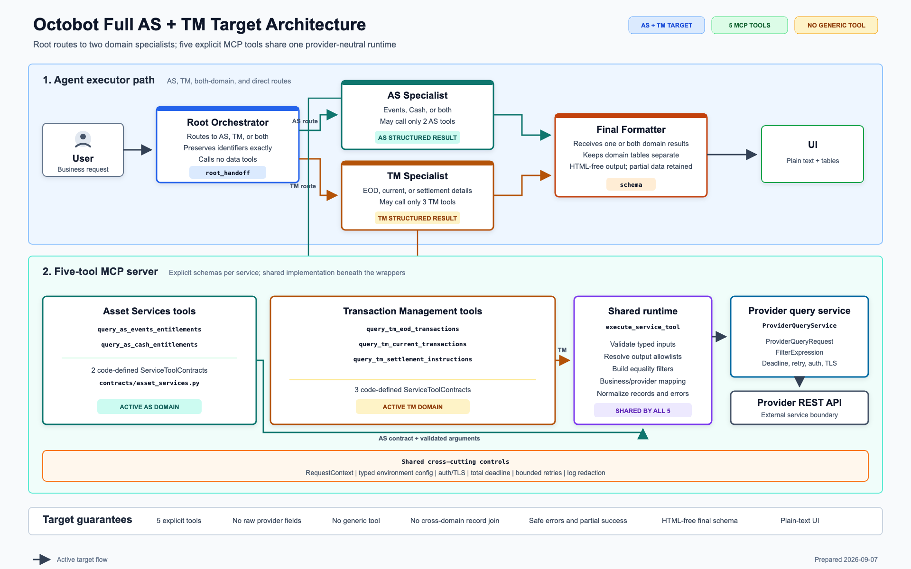

# Octobot Complete Asset Services and Transaction Management Use Case

**Document date:** 2026-09-07  
**Status:** Complete five-tool target operating model  
**Audience:** Product owners, business analysts, architecture, engineering, QA, operations, and support

## 1. Purpose

This page describes the complete Octobot use case across Asset Services (AS)
and Transaction Management (TM). It explains how a user request moves from the
conversation UI through the agent workflow, the five business-specific MCP
tools, the provider service, and back to a plain-text and table response.

The page is intentionally focused on business behavior, component
responsibilities, request flow, examples, controls, and acceptance criteria. It
does not document low-level implementation code or expose provider-specific
technical details.

> **Implementation status:** This is the complete target operating model. All
> two AS tools and all three TM tools are first-class parts of this design and
> are shown as active target paths. The latest verified current implementation
> has only the two AS tools registered. The TM contracts, specialist prompt,
> tool registration, tests, and deployment must be completed before the
> five-tool model is described as the current production runtime.

## 2. Related Artifacts

- [Full AS and TM target architecture](Octobot_Full_AS_TM_Architecture.png)
- [Editable target architecture](Octobot_Full_AS_TM_Architecture.svg)
- [Current AS MCP and agent flow](Octobot_MCP_API_Function_Flow.md)
- [Current AS request walkthrough](Octobot_AS_Request_Flow_Code_Walkthrough.md)

## 3. Business Objective

Octobot provides one conversational entry point for custody users who need
Asset Services or Transaction Management information. The user asks in normal
business language. Octobot determines the domain, obtains any missing required
information, calls only the necessary service tools, and presents grounded
results using standard text and tables.

The solution must:

- support AS-only, TM-only, and combined AS plus TM requests;
- expose one explicit MCP tool for each business service;
- keep provider identifiers and query mechanics away from users and agents;
- preserve user-supplied identifiers exactly;
- return useful successful data even when another requested service fails;
- ask a focused clarification question before an invalid provider call;
- provide a consistent UI response using plain text and structured tables;
- prevent HTML, styling instructions, or untrusted data from controlling the UI.

## 4. Scope

### 4.1 In scope

| Domain | Business capabilities |
|---|---|
| Asset Services | Corporate-action event facts, options, dates, deadlines, event status, payment status, cash entitlements, amounts, tax, currency, payable dates, and value dates |
| Transaction Management | Historical or end-of-day security transactions, current transaction activity, transaction status, and settlement-instruction details |
| Cross-domain | Requests that genuinely require both AS and TM facts, with independent domain results preserved |
| Conversation | Intent routing, missing-input clarification, no-data handling, safe failures, and partial success |
| Presentation | HTML-free plain text, table components, safe notices, and grounded clarification options |

### 4.2 Out of scope

- Creating, cancelling, approving, or modifying a transaction or entitlement.
- Trading, investment advice, forecasting, or ungrounded business conclusions.
- Direct user access to provider URLs, credentials, portable IDs, columns, or
  filter syntax.
- A generic tool that lets an agent choose arbitrary services or provider
  fields.
- Joining AS and TM records unless an approved deterministic business-key rule
  is separately implemented and tested.
- Custom HTML, CSS, colors, scripts, tags, or other user-controlled rendering.

## 5. Target Architecture

The architecture has three logical layers:

1. **Agent execution:** Root Orchestrator, AS Specialist, TM Specialist, and
   Final Response Formatter.
2. **Five-tool MCP service:** two AS tools, three TM tools, shared validation and
   execution, and a provider-neutral query service.
3. **User presentation:** plain text, tables, safe notices, and clarification
   options. JSONB is not a UI format.

## 6. Components and Responsibilities

| Component | Primary responsibility | Must not do |
|---|---|---|
| User interface | Accept the request and render plain text, tables, notices, and options | Render arbitrary HTML or show internal provider data |
| Executor | Coordinate agent steps and pass structured internal handoffs | Treat runtime enum or class objects as serializable state; expose JSONB as the user response |
| Root Orchestrator | Understand intent and select AS, TM, both, direct response, clarification, or out of scope | Call data tools or choose provider fields |
| AS Specialist | Select and call the smallest sufficient set of the two AS tools | Call TM tools, invent joins, or format the final UI answer |
| TM Specialist | Select and call the smallest sufficient set of the three TM tools | Call AS tools, invent joins, or format the final UI answer |
| Five MCP tools | Expose explicit typed business contracts, one per service | Expose raw provider query construction to an agent |
| Shared runtime | Validate values, resolve allowed outputs, build safe requests, enforce deadlines, and normalize results | Make business routing decisions or write user-facing prose |
| Provider query service | Apply authentication, TLS, timeout, bounded retry, and provider transport behavior | Expose secrets or raw provider failures to an agent or user |
| Final Response Formatter | Convert grounded domain results into standard text and tables | Call tools, invent data, join records, or emit HTML |
| Readiness endpoint | Report service readiness independently | Appear as an MCP business tool |

## 7. Agent and Tool Access Model

| Agent | Allowed MCP tools |
|---|---|
| Root Orchestrator | None |
| Asset Services Specialist | `query_as_events_entitlements`, `query_as_cash_entitlements` |
| Transaction Management Specialist | `query_tm_eod_transactions`, `query_tm_current_transactions`, `query_tm_settlement_instructions` |
| Final Response Formatter | None |

The allowlists must be enforced by runtime configuration as well as prompt
instructions. A specialist must never see or call another domain's tools.

## 8. Five-Tool Business Catalog

| Domain | Tool | Use when the user needs | Typical result |
|---|---|---|---|
| AS | `query_as_events_entitlements` | Corporate-action event terms, event type, options, status, dates, deadlines, or payment status | One Events Entitlements table |
| AS | `query_as_cash_entitlements` | Cash entitlement, gross/net/tax amounts, currency, payable date, value date, or related account-level payment facts | One Cash Entitlements table |
| TM | `query_tm_eod_transactions` | Historical or end-of-day security transaction information for an applicable account and date | One EOD Security Transactions table |
| TM | `query_tm_current_transactions` | Current or recent security transaction activity and transaction status | One Current Securities Transactions table |
| TM | `query_tm_settlement_instructions` | Settlement-instruction information associated with current securities transactions | One Settlement Instruction Details table |

Each tool's registered schema is authoritative for its required inputs,
optional filters, supported output fields, data types, limits, and allowed
values. Agents must inspect the live schema instead of guessing those details.

## 9. Tool Selection Rules

| User need | Selected specialist | Smallest sufficient tool set |
|---|---|---|
| Event facts only | AS | Events tool only |
| Cash entitlement facts only | AS | Cash tool only |
| Event facts and related cash entitlement facts | AS | Both AS tools |
| Historical or as-of EOD transaction facts | TM | EOD transactions tool only |
| Current or recent transaction activity | TM | Current transactions tool only |
| Settlement-instruction details only | TM | Settlement-instruction tool only when its schema supports the supplied identifiers |
| Current transaction facts and settlement instructions | TM | Current and settlement-instruction tools |
| AS facts and TM facts | AS and TM | Each specialist independently selects only its required domain tools |

Tools are not called simply because they are available. Every call must be
necessary to answer an explicit part of the user request.

## 10. Root Routing Rules

The Root Orchestrator selects one route after considering the complete business
meaning of the request.

| Route | Meaning | Next action |
|---|---|---|
| `ASSET_SERVICES` | Only AS facts are required | Invoke AS Specialist |
| `TRANSACTION_MANAGEMENT` | Only TM facts are required | Invoke TM Specialist |
| `BOTH` | Independent facts from both domains are required | Invoke AS and TM Specialists concurrently |
| `DIRECT_RESPONSE` | Greeting, thanks, or grounded general explanation | Send directly to Formatter |
| `NEEDS_CLARIFICATION` | The business domain itself is ambiguous | Ask one domain-level question |
| `OUT_OF_SCOPE` | The request is outside supported read-only custody information | Return a concise scope explanation |

The Root preserves the original business meaning and identifiers. It does not
choose individual tools, infer required service fields, or call a provider.

## 11. End-to-End Request Flow

### 11.1 Normal success path

1. The user enters a business request in the UI.
2. The Executor sends the request and safe relevant conversation context to the
   Root Orchestrator.
3. The Root determines whether the request belongs to AS, TM, both domains, a
   direct response, clarification, or out of scope.
4. The Executor invokes only the specialist or specialists selected by the
   route.
5. Each specialist reads its visible tool descriptions and chooses the smallest
   sufficient tool set.
6. The specialist checks the live schema for required inputs and supported
   output fields.
7. If a required business input is missing, the specialist stops that call and
   returns one focused clarification question.
8. For a valid call, the MCP tool and shared runtime validate the request,
   preserve identifiers, resolve approved fields, and build the provider
   request internally.
9. The provider query service performs the external request within configured
   authentication, timeout, and retry controls.
10. The shared runtime maps the response back to approved business field names
    and returns a normalized success, no-data, clarification, or safe error
    result.
11. Each specialist preserves its service results without inventing joins,
    calculations, or replacement values.
12. The Formatter receives the Root handoff and zero, one, or two specialist
    results.
13. The Formatter creates concise plain text and a separate table for each
    successful service result.
14. The UI renders the text and tables. It does not display raw internal JSON,
    JSONB, provider payloads, or HTML.

### 11.2 Combined-domain path

For route `BOTH`, the AS and TM Specialists run concurrently because one
domain's retrieval does not normally depend on the other. Their output remains
separate. The Formatter may place multiple tables in one answer, but it does
not merge AS and TM rows.

### 11.3 Parallel and sequential calls

- Independent tool calls may run in parallel.
- A dependent call runs later only when its schema requires a documented
  business identifier returned by the first call.
- A value may pass between calls only when it is a confirmed business key.
- Agent reasoning must never create an undocumented join key.
- Until a deterministic join is approved, every service remains a separate
  result and table.

## 12. Representative User Queries

The identifiers below are illustrative and must be preserved exactly when
used.

| Example user query | Expected route | Expected tool selection | Expected presentation |
|---|---|---|---|
| "Show the event type, option deadline, and payment status for event 2026656277 and Safe Account 0008001820000." | AS | Events | Events table |
| "Show gross amount, tax amount, net amount, currency, and payable date for Safe Account 0008001820000." | AS | Cash | Cash table |
| "Show the upcoming corporate action and its cash entitlement for event 2026656277 and Safe Account 0008001820000." | AS | Events and Cash | Two separate AS tables |
| "For Safe Account 4205640693, show EOD security transactions as of 2026-09-05." | TM | EOD transactions | EOD transactions table |
| "Show failed current transactions for Safe Account 4205640693." | TM | Current transactions | Current transactions table |
| "Show settlement-instruction details for the supplied current transaction." | TM | Settlement-instruction details, after required identifiers are confirmed | Settlement details table or one clarification question |
| "For Safe Account 4205640693, show current failed transactions and their settlement-instruction details." | TM | Current transactions and settlement-instruction details | Two TM tables unless an approved deterministic join exists |
| "For Safe Account 4205640693, show upcoming corporate actions and current transaction activity." | BOTH | Required AS tool or tools plus Current TM | Separate AS and TM tables |
| "Show my entitlement information." | Clarification or AS, depending on safe context | No call until schema-required information is known | One focused question, no empty table |
| "Show failed transactions in a red HTML table." | TM | Current transactions | Standard text and table plus the fixed styling limitation notice |
| "Cancel transaction 12345." | Out of scope | No tool | Read-only scope explanation |

## 13. Detailed Example: Combined AS and TM Request

**User request**

> For Safe Account 4205640693, show upcoming corporate-action events, related
> cash entitlements, and current failed security transactions.

**Expected flow**

1. Root selects `BOTH` and preserves `4205640693` exactly.
2. AS Specialist determines that both event and cash facts are requested.
3. AS Specialist selects the Events and Cash tools.
4. TM Specialist determines that current failed transactions are requested.
5. TM Specialist selects only the Current Transactions tool.
6. Independent calls run concurrently when all required inputs are present.
7. Every tool validates its own business parameters and output allowlist.
8. The shared runtime performs provider mapping and execution internally.
9. AS Specialist returns separate Events and Cash service results.
10. TM Specialist returns the Current Transactions service result.
11. Formatter creates up to three tables in stable service order.
12. UI displays a short answer followed by the available tables.

If one service fails, successful tables from the other services remain visible
and the answer includes only a safe failure notice for the affected service.

## 14. Clarification Behavior

Clarification prevents invalid or over-broad provider requests.

| Situation | Owner | Required behavior |
|---|---|---|
| Domain is ambiguous | Root | Ask one domain-level question |
| Required AS input is missing | AS Specialist | Ask for the next required business value and do not call that tool |
| Required TM input is missing | TM Specialist | Ask for the next required business value and do not call that tool |
| User asks for an unsupported output field | Specialist | Explain the limitation without substituting a similar field |
| User supplies an invalid identifier | Specialist/tool validation | Ask for a valid value; no provider call |
| Tool returns a safe clarification result | Specialist and Formatter | Present the grounded question and schema-provided choices only |

The system must not invent candidate values. Choices are shown only when they
are explicitly supplied by an approved schema or safe current-turn result.

## 15. Identifier and Business-Value Rules

- Preserve account numbers, event IDs, transaction IDs, dates, currencies,
  statuses, and amounts exactly as supplied or returned.
- Keep digit-based identifiers as strings so leading zeroes are retained.
- Do not append labels or suffixes such as `SN` to an identifier.
- Do not translate a business status into a provider code from memory.
- Do not replace an unknown value with a similar value.
- Do not interpret null, missing, or unavailable as `No`, `false`, or a negative
  business conclusion.
- Treat Safe Account, Safe Account Number, Security Account, and Security
  Account ID as approved expressions for `safe_account` only where the selected
  tool schema supports that parameter.

## 16. Result and Failure Behavior

| Outcome | Business meaning | UI behavior |
|---|---|---|
| `SUCCESS` | Requested service returned usable records | Show concise text and one table per successful service |
| `NO_DATA` | Request was valid but no matching records were found | State that no matching records were found; do not show an empty table |
| `NEEDS_CLARIFICATION` | More user information is required | Ask one focused question and show only grounded options |
| `PARTIAL_SUCCESS` | At least one requested service succeeded and another failed | Keep every successful table and show a safe status for the failed service |
| `FAILED` | All required service calls failed or formatter input was invalid | Show a safe error message with no fabricated data table |
| `OUT_OF_SCOPE` | Request is outside supported capabilities | Explain the supported read-only scope |

Expected failures are returned through the normal response flow. They must not
exist only in logs, and they must not expose stack traces, internal URLs,
provider bodies, credentials, or internal field names.

For an overall tool deadline, the user-facing message is:

> The request took longer than the configured time limit. Please try again.

The specialist does not retry at the agent layer. Any permitted bounded retry
is owned by the provider query service and remains inside one total deadline.

## 17. Final UI Contract

The final user experience is **plain text plus structured tables**.

- The UI does not display JSONB or raw agent state.
- Structured JSON-safe objects may be used internally between execution stages,
  but they are transport data rather than the user presentation.
- Final text contains no HTML, XML, CSS, JavaScript, style attributes, custom
  tags, data URIs, or entity-encoded presentation tags.
- Every successful service result with records produces one table.
- Each table preserves source column order and record order.
- Records from failed or no-data calls never become tables.
- Null remains visibly unknown and is not converted into a negative fact.
- Successful data is retained during partial failure.
- AS and TM tables remain separate unless a deterministic join is approved.

When a user asks for unsupported styling, the response begins with:

> I can provide the requested information using the standard text and table
> format, but custom styling is not supported.

## 18. Functional Requirements

| ID | Requirement |
|---|---|
| FR-01 | Root must route every request to AS, TM, BOTH, direct response, clarification, or out of scope based on business intent. |
| FR-02 | Root and Formatter must have no data-tool access. |
| FR-03 | AS Specialist must have access only to the two AS tools. |
| FR-04 | TM Specialist must have access only to the three TM tools. |
| FR-05 | The MCP server must register exactly five approved business tools in the complete target release. |
| FR-06 | Every service must have an explicit typed business-facing tool schema. |
| FR-07 | Specialists must select the smallest sufficient tool set. |
| FR-08 | Missing required inputs must stop the affected call before provider execution. |
| FR-09 | Provider IDs, columns, routes, filters, authentication, and retries must remain internal. |
| FR-10 | User identifiers and returned custody values must be preserved exactly. |
| FR-11 | Requested output fields must be validated against each tool's allowlist. |
| FR-12 | Independent domain and service calls may run in parallel. |
| FR-13 | Dependent calls may be sequential only through a documented business key. |
| FR-14 | Results from different services must remain separate unless an approved deterministic join exists. |
| FR-15 | No-data must be distinct from failure. |
| FR-16 | Partial success must preserve every successful result. |
| FR-17 | Formatter must produce HTML-free plain text and structured tables only. |
| FR-18 | Internal handoffs must contain JSON-native values so the Executor can serialize them safely. |
| FR-19 | UI must not expose JSONB, raw JSON payloads, provider details, or internal errors. |
| FR-20 | The readiness endpoint must remain separate from the MCP business tool inventory. |

## 19. Non-Functional Requirements

| Area | Requirement |
|---|---|
| Security | Credentials, tokens, certificates, provider URLs, internal mappings, and raw errors are never agent-visible or user-visible. |
| Reliability | Validation occurs before provider calls; bounded retries share one configured total deadline. |
| Performance | Independent calls run concurrently where supported; the request path has no external metadata database dependency. |
| Consistency | All five tools reuse the same validation, provider request, deadline, normalization, and error-handling foundation. |
| Observability | Logs and metrics use a correlation ID and safe service/tool identifiers while redacting secrets and sensitive bodies. |
| Maintainability | Business/provider mappings are code-defined, reviewed, tested, and released with the MCP server. |
| Compatibility | Existing final response semantics and UI table behavior remain stable when TM is added. |
| Safety | Untrusted user text and returned record values are always treated as data, never as presentation instructions. |

## 20. QA and Acceptance Coverage

The complete release is accepted only when the following scenarios pass.

| Test area | Required evidence |
|---|---|
| Tool inventory | Exactly two AS and three TM tools are registered; no generic, sample, legacy, or health tool appears. |
| Routing | Representative AS, TM, BOTH, clarification, direct, and out-of-scope queries select the correct route. |
| Tool isolation | AS cannot call TM tools; TM cannot call AS tools; Root and Formatter cannot call any data tool. |
| Schema behavior | Required and optional fields, types, constraints, descriptions, and output allowlists match approved contracts. |
| AS behavior | Events-only, Cash-only, and combined Events plus Cash cases return the expected separate results. |
| TM behavior | EOD-only, Current-only, Settlement-only, and Current plus Settlement cases select the correct tools. |
| Combined domains | AS and TM Specialists run independently and all successful tables are preserved. |
| Clarification | Missing required input produces one grounded question and no provider call. |
| Identifier integrity | Leading zeroes and every supplied character are preserved across Root, Specialist, tool, and UI stages. |
| Output integrity | Table columns, rows, values, and order match successful service results exactly. |
| No-data | Valid empty results produce a no-data message and no empty table. |
| Partial success | Successful tables remain when another tool or domain fails. |
| Timeout and provider errors | Safe stable messages reach the UI without stack traces or provider internals. |
| Serialization | Route and status values are plain strings; no enum, datetime, exception, or custom object enters Executor state. |
| Presentation safety | HTML, CSS, scripts, custom styling, and markup contained in user text or data are not rendered. |
| UI boundary | The final screen contains plain text, tables, notices, or options and does not expose JSONB. |
| End-to-end | User -> Root -> selected Specialist(s) -> MCP -> provider -> Formatter -> UI passes for all five tools. |

## 21. TM Confirmation Gates Before Production

TM is fully included in the target use case, but these contract details must be
confirmed from approved service documentation and live schemas before release:

1. Required filters and optional filters for each TM service.
2. Approved output fields, aliases, value types, and default columns.
3. Exact date and timezone semantics for EOD requests.
4. Whether settlement-instruction requests can run independently or require a
   transaction identifier from the Current Transactions result.
5. The approved business key for any future deterministic relationship between
   Current Transactions and Settlement Instruction Details.
6. Service-specific limits when they differ from the common agent limit.
7. Error mappings and retry behavior for each provider service.

No prompt should guess these details. They become usable only after they are
encoded in the reviewed tool contracts and verified by schema and end-to-end
tests.

## 22. Deployment Completion Criteria

The five-tool operating model is complete when:

1. Root supports AS, TM, and BOTH routes.
2. AS and TM Specialist prompts and runtime allowlists are deployed.
3. All five service contracts and explicit tool wrappers are registered.
4. All five tools use the shared runtime and provider query service.
5. Provider details remain internal and no generic tool is introduced.
6. Formatter accepts one or both domain results and preserves partial success.
7. UI renders plain text and tables without HTML or JSONB exposure.
8. Tool inventory, schema, routing, domain, failure, serialization, and
   presentation-safety tests pass.
9. End-to-end tests pass for each individual tool, multi-tool requests within a
   domain, and the combined AS plus TM route.
10. The live deployed tool inventory and schemas match the approved release.

## 23. Glossary

| Term | Meaning |
|---|---|
| AS | Asset Services |
| TM | Transaction Management |
| MCP | Protocol boundary through which specialists call approved business tools |
| Root Orchestrator | Agent that selects the business domain route |
| Specialist | Domain agent that chooses and calls only its approved tools |
| Shared runtime | Common deterministic validation, mapping, execution, and normalization layer used by all five tools |
| Provider query service | Internal boundary that communicates with the external provider API |
| Partial success | At least one requested service succeeded while another failed |
| Plain text plus tables | The supported final UI presentation; no custom HTML or raw JSONB |
